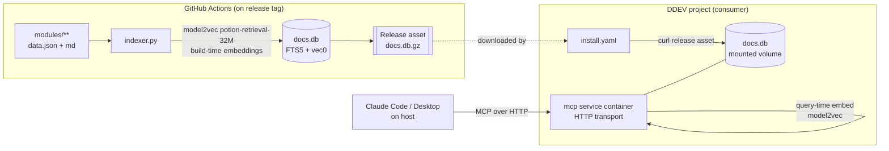

# Agent Module Docs — MCP add-on design

Design for turning the current single-file MCP server into a **DDEV add-on** backed by a
**prebuilt hybrid-search SQLite database**, released via GitHub Actions and served over
**HTTP** from inside the DDEV container.

Status: **steps 1–4 built** (see §12). Indexer + shared embedder build the full `docs.db` in
~26 s; hybrid stdio+HTTP server verified with a real MCP client; the CI workflow and the
`ddev-drupal-agent-module-knowledge-mcp` add-on repo are scaffolded and locally validated.
Remaining: create the GitHub repos, swap the `YOUR_GH_OWNER` placeholder, push a tag.
Decisions locked:

- **Search:** hybrid — FTS5 (BM25 lexical) + `sqlite-vec` (vector) fused with RRF.
- **Transport:** HTTP MCP service running in a DDEV container.
- **DB build:** once per release in CI, shipped as a release artifact (not built on install).

---

## 1. Goals & constraints

| Goal | Consequence |
|------|-------------|
| Zero build work on the consumer's machine | DB + vectors are **prebuilt in CI**, downloaded at install. |
| One portable artifact, no extra services | **SQLite only** (FTS5 + `sqlite-vec`), no Solr/Postgres. |
| Good discovery, not just known-item lookup | **Hybrid** lexical+semantic search over doc *bodies*. |
| Runs on 16 GB / CPU-only | Corpus embedding is a **build-time** job; runtime embeds only the query. |
| Idiomatic DDEV | Server is an **HTTP service**; registration is a URL. |
| Never reach outside the docs tree | Read-only DB; path traversal already closed; HTTP bound to the DDEV router. |

Corpus scale today: ~9,222 modules / ~9,356 version dirs / ~41 MB of `data.json` plus the
`usage.md` + `agent/**` bodies. Small — SQLite is comfortably the right tool.

---

## 2. Architecture



Two lifecycles, deliberately separated:

- **Build (CI):** heavy, occasional. Reads the corpus, embeds every doc, writes `docs.db`.
- **Serve (container):** light, always-on. Opens the prebuilt DB read-only, embeds only the
  incoming query, runs hybrid search.

---

## 3. Database schema (`docs.db`)

One file. Content tables + an FTS5 index + a `sqlite-vec` vector table + a metadata row.

```sql
-- Canonical module rows (newest + historical versions).
CREATE TABLE modules (
  id              INTEGER PRIMARY KEY,
  machine_name    TEXT NOT NULL,
  name            TEXT NOT NULL,
  description     TEXT,
  version         TEXT NOT NULL,          -- 'major.minor.x'
  is_latest       INTEGER NOT NULL,       -- 1 for newest version of this machine_name
  active_installs INTEGER DEFAULT 0,
  categories      TEXT,                   -- JSON array
  keywords        TEXT,                   -- JSON array
  project_url     TEXT,
  rel_path        TEXT NOT NULL           -- path under modules/, for read_doc
);

-- One row per documentation file (start.md, usage section, each agent/**.md).
CREATE TABLE docs (
  id            INTEGER PRIMARY KEY,
  module_id     INTEGER NOT NULL REFERENCES modules(id),
  machine_name  TEXT NOT NULL,
  version       TEXT NOT NULL,
  doc_path      TEXT NOT NULL,            -- e.g. 'agent/api/token-service.md'
  doc_type      TEXT NOT NULL,            -- start | usage | agent | data
  title         TEXT,
  body          TEXT NOT NULL
);

-- BM25 lexical index over the searchable text. External-content FTS5 over `docs`
-- plus synthesized metadata text, porter+unicode61 tokenizer.
CREATE VIRTUAL TABLE docs_fts USING fts5(
  machine_name, name, keywords, categories, title, body,
  content='',                             -- contentless; we store our own rows
  tokenize='porter unicode61'
);

-- Vector index (sqlite-vec). One embedding per docs row; rowid == docs.id.
CREATE VIRTUAL TABLE vec_docs USING vec0(
  embedding float[512]                    -- potion-retrieval-32M dimensionality
);

-- Build provenance / compatibility guard.
CREATE TABLE meta (
  schema_version TEXT,                    -- e.g. '1'
  corpus_commit  TEXT,                    -- git SHA of the docs at build time
  model_name     TEXT,                    -- 'minishlab/potion-retrieval-32M'
  model_dim      INTEGER,                 -- 512
  built_at       INTEGER,                 -- unix ts
  doc_count      INTEGER
);
```

The server refuses to start if `meta.model_name` / `model_dim` don't match the query-time
embedder — mixing models silently ruins semantic results.

### Chunking

Agent docs are already written to be short (that's the project's whole point), so granularity
is simple:

- `agent/start.md`, each `agent/**/*.md` → **one row/vector each** (already sub-page sized).
- `usage.md` → split on the `---` separators (short/long summary, use-cases) → one row per
  section.
- `data.json` → one synthesized row: `"{name} — {description}. Keywords: … Categories: …"`,
  so metadata is searchable semantically without dumping raw JSON into the index.

Corpus stats (measured): **9,356 module-versions → 53,810 doc units**, body length median
575 chars / mean 874 / p90 1,916. Well within the model's context; no sliding-window chunking
needed. (`data.json` is only doc `data`-type body ~ metadata sentence.)

---

## 4. Embedding model — **model2vec `potion-retrieval-32M`** (changed from bge-small)

> **Decision changed during step-1 prototyping.** The plan was `bge-small` via fastembed, but
> a benchmark on this corpus killed it: fastembed ran at **1.2 docs/s** (an unoptimized
> onnxruntime build; `threads=8` made no difference) → **~12 h** for the full corpus. That's
> untenable for CI *and* makes query-time embedding sluggish. **model2vec static embeddings
> run ~6,000× faster** with no onnxruntime/torch, and — critically — hybrid retrieval quality
> held up (see §4a). So the design now standardizes on model2vec for **both** build and query.

| Phase | Where | Model | Measured |
|-------|-------|-------|----------|
| Corpus embed | CI runner | `minishlab/potion-retrieval-32M` (512-dim, static) | **6,338 docs/s** → full corpus in **~9 s** (26 s incl. scan+FTS+write) |
| Query embed | container | **same** model | sub-ms; ~100 ms end-to-end hybrid query |

- **model2vec** = distilled *static* embeddings: a token→vector lookup + pooling, no neural
  runtime. Dependency is a few-MB model + numpy. `potion-retrieval-32M` is the strongest
  static *retrieval* model.
- One shared `embed.py` is imported by **both** the indexer and the server, so build and query
  vectors are guaranteed to live in the same space. Vectors are L2-normalized → sqlite-vec's
  L2 distance ranks identically to cosine.
- **Alternatives considered:** `potion-base-8M` (256-dim, ~8k docs/s — halves the vector
  footprint, marginally lower quality); a transformer model (`bge-small`, `nomic-embed`) only
  if a future quality gap demands it and CI gets a GPU/proper onnxruntime.

**16 GB question, dissolved:** runtime footprint is now ≈ a few-MB static model + the mmap'd
DB. There is no meaningful memory pressure; the earlier ONNX-model concern is gone.

### 4a. Validation results (full corpus, step-1 prototype)

Built the **entire** corpus (`docs.db`, 199 MB / **128 MB gzipped**) and ran hybrid
(BM25 + vector RRF) queries. Retrieval is strong — every probe surfaces the right modules:

| query | top hits |
|-------|----------|
| send email with SMTP | `phpmailer_smtp`, `smtp`, `mailgun`, `symfony_mailer_lite`, `postmark` |
| image styles and cropping | `crop`, `focal_point`, `image_widget_crop`, `automated_crop` |
| REST API authentication token | `rest_api_access_token`, `key_auth`, `jwt`, `simple_oauth` |
| schedule content to publish later | `scheduler`, `scheduled_publish`, `scheduled_transitions` |
| single sign-on with SAML | `samlauth`, `saml_sp`, `miniorange_saml` |
| spam protection on webforms | `protected_forms`, `honeypot`, `spambot`, reCAPTCHA/webform |

Latency ~100 ms/query after a one-off model warmup. Conclusion: **model2vec + BM25 hybrid is
good enough to ship**; a transformer upgrade is not needed for v1.

---

## 5. Indexer (build-time) — `indexer.py`

Pure build tool; never ships to consumers. Roughly:

1. Walk `modules/**/<ver>/` (reuse the current `VERSION_RE` + `data.json` scan).
2. For each version dir: insert a `modules` row; emit `docs` rows (start/usage-sections/agent
   files/data-synth) with `doc_type` + `title`.
3. Populate `docs_fts` from each `docs` row + its module metadata.
4. Batch-embed all `docs.body` via the shared `embed.py` (model2vec); insert into `vec_docs`
   keyed by `docs.id`.
5. Write `meta`. `VACUUM`. Emit `docs.db`.

Deterministic and re-runnable; same corpus commit → same DB (modulo `built_at`).
**Measured:** full build (scan → FTS → embed → write → vacuum) in **26 s** on an 8-core CPU.

---

## 6. Release via GitHub Actions

`.github/workflows/release-db.yml`, triggered on `v*` tags (or `workflow_dispatch`):

```yaml
on:
  push: { tags: ['v*'] }
jobs:
  build-db:
    runs-on: ubuntu-latest
    steps:
      - uses: actions/checkout@v4
      - uses: actions/setup-python@v5
        with: { python-version: '3.12' }
      - run: pip install model2vec sqlite-vec numpy
      - run: python mcp/indexer.py --out docs.db --corpus modules
      - run: gzip -9 -k docs.db          # ship compressed (~128 MB)
      - uses: softprops/action-gh-release@v2
        with:
          files: |
            docs.db.gz
```

Notes:

- The whole build is ~30 s of CPU (measured), so even a free standard `ubuntu-latest` runner
  is ample — no model download to cache, no GPU. Comfortably free on public repos.
- Release asset size cap is 2 GB; our ~128 MB compressed DB is well under. No Git LFS needed.
- Pin `model2vec` + `sqlite-vec` versions so the embedding space is stable across releases.
- Tag the DB with `corpus_commit = $GITHUB_SHA` for traceability.

---

## 6a. Repository topology — two repos, cleanly split

**Yes — the documentation and the DDEV add-on can (and should) live in separate repos.**
The corpus and the add-on change on different cadences and have different audiences, so
splitting them is the right call, not just a possible one.

```
repo A: agent-module-documentation   (this repo — the corpus)
  modules/**              the docs
  indexer-spec.md         documented data format the indexer relies on
  [optional] corpus release: tar of modules/** tagged per wave

repo B: ddev-drupal-agent-module-knowledge-mcp       (the add-on + build tooling)
  indexer.py              reads repo A's corpus  → docs.db
  server/                 HTTP MCP service
  install.yaml, compose   the DDEV add-on
  .github/workflows/      builds docs.db from repo A, publishes release + GHCR image
```

**How B gets A's corpus in CI** — three options, cleanest first:

1. **Corpus release (decoupled, recommended).** Repo A publishes a `corpus-<wave>.tar.gz`
   release (or just tags). Repo B's workflow downloads that tagged tarball, runs `indexer.py`,
   publishes `docs.db`. The DB's `meta.corpus_commit` records exactly which corpus it came from.
   No cross-repo checkout token needed if A is public.
2. **Cross-repo checkout.** Repo B's workflow does `actions/checkout` with
   `repository: <owner>/agent-module-documentation` (add a PAT/deploy key if A is private),
   then indexes the working tree.
3. **Push-to-build.** Repo A fires a `repository_dispatch` at repo B when a doc wave lands
   (`peter-evans/repository-dispatch`), so a new corpus auto-triggers a fresh DB release.
   Combine with (1) or (2) for the actual fetch.

**Where does `indexer.py` live?** In **repo B** (the add-on) — the DB is the add-on's
deliverable, and the indexer encodes the DB *schema*. Repo A only owes it a stable corpus
*format*; document that contract (`indexer-spec.md`) in A so a corpus change that would break
indexing is a conscious edit. This keeps repo A purely about content and repo B about
packaging/serving.

**Versioning across the split:** add-on release `vX` pins (a) the corpus tag it indexed and
(b) the `docs.db` asset it published — so `ddev add-on get …@vX` always yields a matching
server + DB, independent of where repo A has moved since.

## 7. DDEV add-on packaging

Add-on repo layout (installed via `ddev add-on get <owner>/ddev-drupal-agent-module-knowledge-mcp`):

```
ddev-drupal-agent-module-knowledge-mcp/
├── install.yaml
├── docker-compose.agent-module-docs.yaml   # the HTTP MCP service
├── server/
│   ├── server.py            # HTTP MCP transport, hybrid query
│   ├── embed.py             # shared embedder (same file as build-time)
│   ├── requirements.txt     # mcp, sqlite-vec, model2vec, numpy  (no torch/onnx)
│   └── Dockerfile           # python:3.12-slim + deps + PRE-BAKED model
└── README.md                # registration instructions
```

**Dockerfile must pre-bake the model** — `model2vec` otherwise fetches it from HuggingFace on
first query (verified: the server hits `huggingface.co` on cold start). Bake it at build and
run offline so the container needs no network:

```dockerfile
RUN pip install --no-cache-dir -r requirements.txt
RUN python -c "from model2vec import StaticModel; \
    StaticModel.from_pretrained('minishlab/potion-retrieval-32M')"   # caches into the image
ENV HF_HUB_OFFLINE=1
CMD ["python", "server.py", "--http", "--host", "0.0.0.0", "--port", "9130"]
```

### `install.yaml` (sketch)

```yaml
name: agent-module-docs
ddev_version_constraint: '>= v1.24.0'

pre_install_actions:
  - mkdir -p ${DDEV_APPROOT}/.ddev/agent-module-docs

post_install_actions:
  # Pull the prebuilt DB for the pinned release.
  - |
    curl -sfL \
      https://github.com/<owner>/ddev-drupal-agent-module-knowledge-mcp/releases/download/#ADDON_VERSION#/docs.db.gz \
      | gunzip > ${DDEV_APPROOT}/.ddev/agent-module-docs/docs.db
  - "echo 'Register in your AI client — see README (HTTP MCP URL below).'"

removal_actions:
  - rm -rf ${DDEV_APPROOT}/.ddev/agent-module-docs
```

### `docker-compose.agent-module-docs.yaml` (sketch)

A sidecar service; DDEV's router exposes it over HTTPS on the project domain.

```yaml
services:
  agent-module-docs:
    build: { context: ./agent-module-docs/server }   # or a prebuilt image
    container_name: ddev-${DDEV_SITENAME}-agent-module-docs
    labels:
      com.ddev.site-name: ${DDEV_SITENAME}
      com.ddev.approot: ${DDEV_APPROOT}
    environment:
      - VIRTUAL_HOST=$DDEV_HOSTNAME
      - HTTP_EXPOSE=9130:9130                 # router → container port
      - HTTPS_EXPOSE=9131:9130
      - DOCS_DB=/data/docs.db
    volumes:
      - ".:/mnt/ddev_config"
      - "./agent-module-docs:/data"           # docs.db lives here
    restart: unless-stopped
```

Resulting endpoint (example): `https://<project>.ddev.site:9131/mcp`.

### Registration (README output)

```bash
# Claude Code
claude mcp add --transport http agent-module-docs https://<project>.ddev.site:9131/mcp
```

```jsonc
// Claude Desktop — claude_desktop_config.json
{ "mcpServers": { "agent-module-docs": {
    "transport": "http",
    "url": "https://<project>.ddev.site:9131/mcp"
} } }
```

---

## 8. MCP server runtime (HTTP)

Same five tools as today (`search_modules`, `get_module`, `list_docs`, `read_doc`,
`list_categories`), reimplemented over the DB and served with the MCP **Streamable HTTP**
transport (Python `mcp` SDK, or a minimal ASGI app if we keep it dependency-lean).

`search_modules` becomes **hybrid**:

```python
def search(query, k=20):
    # 1. lexical
    lex = db.execute(
        "SELECT rowid, rank FROM docs_fts WHERE docs_fts MATCH ? "
        "ORDER BY rank LIMIT ?", (fts_query(query), 60)).fetchall()
    # 2. semantic
    qv = embed_one(query)                   # model2vec, one string, sub-ms
    sem = db.execute(
        "SELECT rowid, distance FROM vec_docs "
        "WHERE embedding MATCH ? ORDER BY distance LIMIT ?", (qv, 60)).fetchall()
    # 3. Reciprocal Rank Fusion (k0=60), then group by module, newest version wins
    fused = rrf(lex, sem, k0=60)
    return top_modules(fused, k)
```

- `read_doc` / `get_module` still stream file *content* from `modules/` if mounted, or serve
  the `docs.body` stored in the DB (so the container needs only `docs.db`, not the whole tree).
  **Decision to make:** ship bodies in the DB (self-contained, ~larger DB) vs mount the docs
  tree read-only (smaller DB, needs the corpus present). Leaning **bodies-in-DB** for a truly
  self-contained artifact.
- Graceful degradation: if `sqlite-vec` or the model is unavailable, fall back to FTS5-only and
  say so in the tool result.

---

## 9. Versioning & compatibility

- `meta.schema_version` bumped on any schema change; server checks it on boot.
- `meta.model_name`/`model_dim` must equal the query embedder → else refuse (or FTS-only mode).
- Add-on version ↔ DB release are pinned together (`#ADDON_VERSION#` in the download URL), so
  `ddev add-on get` always pulls a DB that matches the server code it installed.

---

## 10. Security posture

- DB opened **read-only** (`file:docs.db?mode=ro`, `PRAGMA query_only`).
- `read_doc` path guard (realpath containment, is-file, no traversal/symlink escape) carries
  over — and if bodies live in the DB, `read_doc` does no filesystem access at all.
- HTTP endpoint is published through the **DDEV router**, reachable from the host, not the
  public internet. If anyone later exposes it beyond localhost, add a bearer token
  (`Authorization` check) and/or bind to `127.0.0.1` — noted as a follow-up, not v1.
- Service container runs as non-root, no shell exec, no network egress needed at runtime
  (model is baked into the image at build).

---

## 11. Open decisions (before coding)

1. **Bodies in DB vs mount the docs tree** — self-contained artifact vs smaller DB. (Leaning: in DB.)
2. **Cross-repo corpus fetch mechanism** — decided to split into two repos (see §6a); the
   remaining choice is *how* the add-on's CI pulls the corpus: corpus-release tarball
   (recommended) vs cross-repo checkout vs push-to-build dispatch.
3. **Prebuilt service image** — publish to GHCR for fast installs vs `build:` on the consumer
   (needs Docker build locally). (Leaning: publish image to GHCR.)
4. **Vector size** — keep `potion-retrieval-32M` (512-dim, 128 MB gz) or drop to
   `potion-base-8M` (256-dim) / int8-quantize vectors to shrink the asset if download size
   matters. (Decided the model itself: model2vec, see §4.)
5. **Refresh cadence** — tie DB releases to documentation waves; add a `ddev agent-module-docs
   update` command to re-pull the latest DB without reinstalling the add-on.

---

## 12. Suggested build order

1. ✅ **Done** — `indexer.py` + `embed.py` + `query_test.py` → retrieval quality proven on the
   full corpus (§4a).
2. ✅ **Done** — hybrid `server.py` (FastMCP): reuses `embed.py`, reads `docs.db` read-only,
   bodies + full `data.json` in-DB (self-contained). Both **stdio and Streamable HTTP**
   transports verified with a real MCP client. Model-guard on boot. Registered locally in
   Claude Code (stdio, via the venv).
3. ✅ **Scaffolded** — `.github/workflows/release.yml`: on a `v*` tag, fetches the corpus
   (source tarball of repo A @ `CORPUS_REF`), builds `docs.db.gz`, attaches it to the Release,
   and builds+pushes the server image to GHCR. YAML validated; corpus fetch = tarball (locked).
4. ✅ **Scaffolded + container verified** — the `ddev-drupal-agent-module-knowledge-mcp` repo
   exists (sibling dir): `install.yaml` (downloads the DB), `docker-compose.agent-module-docs.yaml`
   (router-exposed HTTP service), `server/Dockerfile` (pre-baked model, non-root), `tests/test.bats`,
   `README.md`. **The image was built and run with `--network none`** (fully offline): it booted,
   loaded the mounted DB, passed the model-guard from the baked cache, and an MCP client *inside*
   the container ran `search_modules`/`get_module` correctly. Proves `sqlite-vec` loads in slim
   and `model2vec` needs no runtime network. **Remaining before publish:** create the GitHub
   repos, replace `YOUR_GH_OWNER` in 3 files, push a `v*` tag.
```
