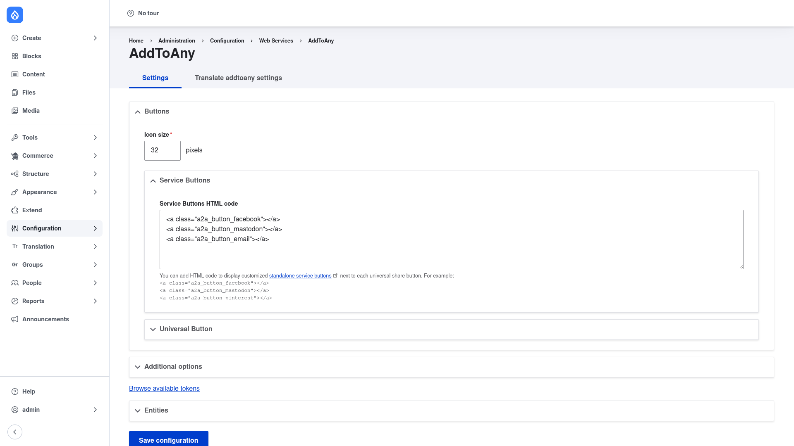

# AddToAny — manual setup guide

**AddToAny** (`addtoany`) adds social media **share** and **follow** buttons to
your content, letting a visitor share any page to Facebook, Mastodon, Pinterest,
WhatsApp, email, and hundreds of other networks. It is powered by the hosted
AddToAny universal sharing platform: you pick a button style and the services you
want, and AddToAny renders the buttons for you.

Out of the box the share buttons appear on your content (nodes, and optionally
media and comments). You can also place them anywhere on the page as the
**AddToAny** block, or reposition them on each content type's display settings.

This guide is written for a **human** clicking through the admin UI. It walks you,
step by step and with screenshots, from installing the module to configuring which
buttons appear and where. If you are looking for terse, token-cheap references for
an AI coding agent, read the sibling [`agent/`](../agent/start.md) docs instead.

## Where it lives in the admin menu

Everything in this guide sits under **Configuration → Web Services → AddToAny**
(`/admin/config/services/addtoany`). That single settings form controls the button
icon size, which specific services show, the universal share button, any additional
code, and which entity types display buttons.

## Contents

1. [Installation](installation/index.md) — install AddToAny with Composer and
   enable it.
2. [Configuration](configuration/index.md) — choose your button style and size,
   the services to show, the universal button, and where the buttons appear.
