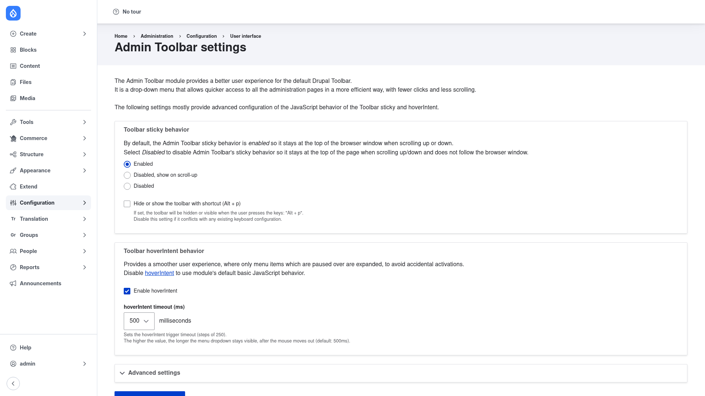

# Configuration

Admin Toolbar works out of the box — everything on this page is **optional
tuning**. The settings only adjust how the toolbar behaves (its sticky
positioning, an optional keyboard toggle, hoverIntent timing, and how deep the
menus render). If you never open this form, the module still works.

## Open the settings form

1. Log in as a user with the **Administer site configuration** permission (an
   administrator by default).
2. Go to **Configuration → User interface → Admin Toolbar**, or navigate directly
   to `/admin/config/user-interface/admin-toolbar`.

You'll land on the **Admin Toolbar settings** page:

The intro text explains that these settings mostly provide advanced configuration
of the toolbar's JavaScript behavior. The form is grouped into sections.

## Toolbar sticky behavior

This controls whether the toolbar follows you as you scroll. Pick one of the radio
options:

- **Enabled** *(default)* — the toolbar stays pinned to the top of the browser
  window while you scroll up or down, so admin navigation is always in reach.
- **Disabled, show on scroll‑up** — the toolbar hides when you scroll down and
  reappears when you scroll up, freeing screen space while reading long pages.
- **Disabled** — the toolbar sits at the top of the *page* and does not follow the
  browser window as you scroll.

Below the radios is a checkbox:

- **Hide or show the toolbar with shortcut (Alt + p)** — when ticked, pressing
  **Alt + p** toggles the whole toolbar on and off. Leave it unchecked if that key
  combination clashes with another keyboard shortcut you rely on.

## Toolbar hoverIntent behavior

hoverIntent makes submenus feel smoother by only expanding a menu item you
deliberately pause on, rather than every item your cursor happens to sweep across.

- **Enable hoverIntent** *(checked by default)* — leave this on for the polished
  "pause to open" behavior. Unchecking it falls back to the module's basic
  JavaScript, where menus open on any hover.
- **hoverIntent timeout (ms)** — a dropdown (in steps of 250, default **500**)
  setting how long a submenu stays open after the mouse moves away. A higher value
  keeps the drop‑down visible longer, which is forgiving if your aim wanders; a
  lower value snaps menus closed faster.

## Advanced settings

At the bottom the form has a collapsed **Advanced settings** section — click it to
expand. This is where you control the **menu depth**: how many levels of the admin
menu the drop‑downs render (default **4**). Increase it if you have deeply nested
admin menus (for example many content types, vocabularies, or Views) and want
their child links to appear in the fly‑outs; decrease it to keep the menus
shallower and faster.

## Save

Click **Save configuration** at the bottom of the form. Your changes take effect
immediately — reload any admin page and hover over the toolbar to see the new
behavior.
