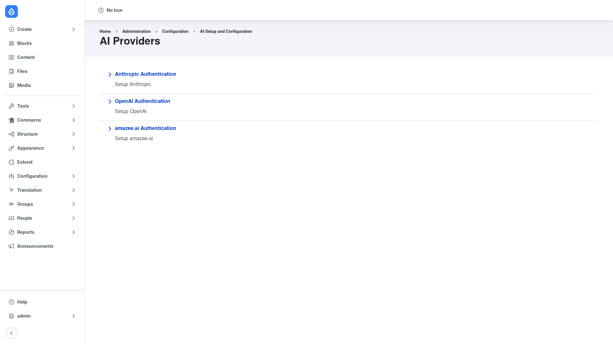
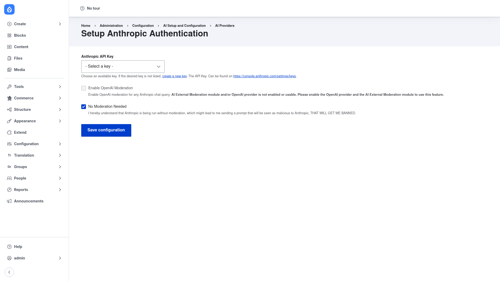

# Configuration — connect an AI provider

AI Agents does not talk to an AI model directly. It goes through the **AI Core**
(`ai`) module, which manages **providers** (OpenAI, Anthropic, amazee.ai, …). Before
an agent can run you must:

1. Enable a provider module.
2. Store your API key.
3. Point the provider at that key.
4. (Recommended) Set a default model so agents have something to call.

You can view and edit agents without any of this — but pressing **Run Agent** will
fail until a working provider is configured.

## 1. Enable a provider module

Pick the provider you have an account with and enable its module. For example, for
Anthropic (Claude):

```bash
composer require drupal/ai_provider_anthropic -W
drush en ai_provider_anthropic -y
```

The equivalent OpenAI module is `drupal/ai_provider_openai`.

## 2. Store your API key with the Key module

Never paste a raw API key into a form or commit it to code. Use the **Key** module,
which keeps the secret out of your configuration export.

```bash
composer require drupal/key -W
drush en key -y
```

The recommended pattern is to put the secret in an **environment variable** and have
Key read it from there. On DDEV:

```bash
# From your host machine:
ddev dotenv set .ddev/.env --anthropic-api-key=sk-ant-...   # never commit .ddev/.env
ddev restart
```

Then create a Key entity backed by that variable:

```bash
drush key:save anthropic_api_key --label='Anthropic API Key' \
  --key-type=authentication --key-provider=env \
  --key-provider-settings='{"env_variable":"ANTHROPIC_API_KEY","base64_encoded":false,"strip_line_breaks":true}' \
  --key-input=none -y
```

You can also create a key through the UI at **Configuration → System → Keys**
(`/admin/config/system/keys`) — click **Add key** and choose a suitable provider.

## 3. Point the provider at the key

Go to **Configuration → AI Setup and Configuration → AI Providers**
(`/admin/config/ai/providers`). Each enabled provider has a **… Authentication**
row — expand the one you want and open its setup form.



On the provider's authentication form, pick the key you just created from the
**API Key** dropdown, then **Save configuration**:



- **API Key** — select the Key entity holding your secret. If it isn't listed,
  use the **create a new key** link on this form.
- **Enable OpenAI Moderation / No Moderation Needed** — moderation is optional. If
  you have no external moderation set up, tick **No Moderation Needed** to
  acknowledge that prompts are sent without it.

## 4. Set a default model

Agents need a model to call. Set default provider/model choices under **Configuration
→ AI Setup and Configuration** (the **AI** settings page,
`/admin/config/ai/settings/nojs`) for the operation types your agents use (chat /
tools). You can also pick a model per run in the Agent Explorer — see
[Running an agent](../running-an-agent/index.md).

## Verify

Once a provider shows a selected key and you have a default (or per‑run) model, you
are ready to [create](../creating-an-agent/index.md) and
[run](../running-an-agent/index.md) agents.
