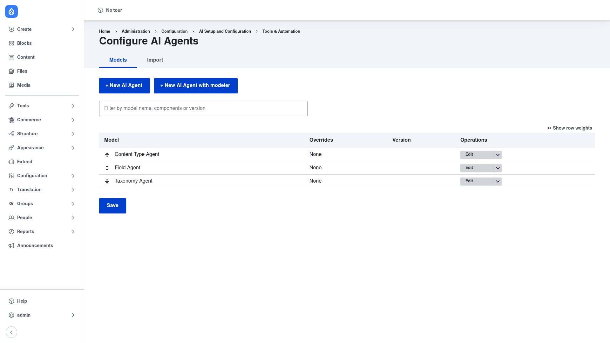
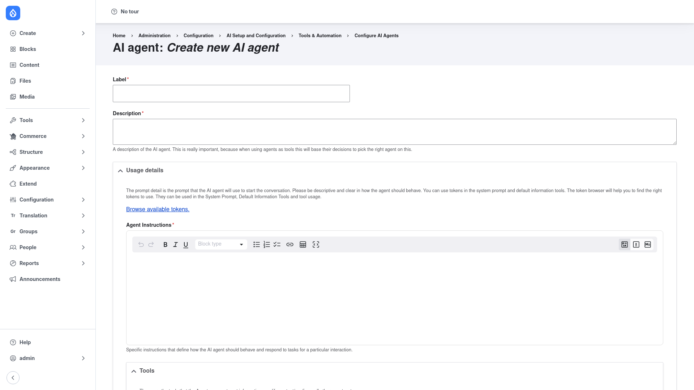
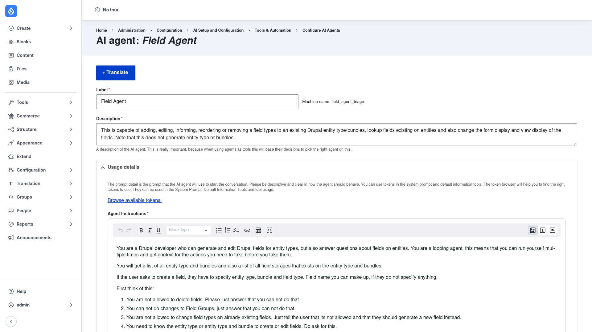
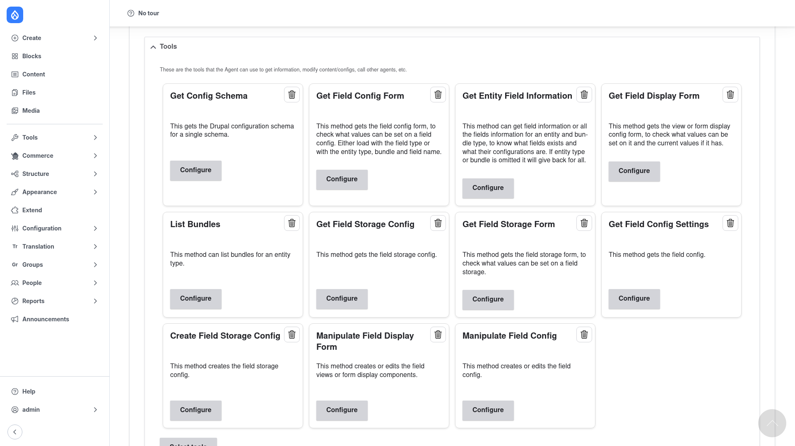

# Creating an agent

An **agent** is a saved configuration: a name, a system prompt telling the AI how to
behave, and the set of **tools** it is allowed to call. You can build a brand‑new
agent, or clone/override one of the three defaults. This page covers building one
from the admin form.

## Open the agent list

Go to **Configuration → AI Setup and Configuration → Tools & Automation → Configure
AI Agents** (`/admin/config/ai/tools-automation/agents`).

From here you can:

- **+ New AI Agent** — the standard form (covered below).
- **+ New AI Agent with modeler** — the same agent edited as a BPMN diagram
  (requires the `bpmn_io` module).
- **Edit** any existing agent from the **Operations** column.
- The **Import** tab — paste an exported agent's YAML to recreate it.

## Fill in the create form

Click **+ New AI Agent**. You get this form:

Fill it in top to bottom:

1. **Label** *(required)* — a human‑readable name, e.g. *Blog Builder Agent*. Drupal
   derives the machine name from this.
2. **Description** *(required)* — what the agent is for. This matters more than it
   looks: when one agent can delegate to others, it uses these descriptions to
   decide which sub‑agent to hand a task to. Be specific about what the agent does
   and does *not* do.
3. **Agent Instructions** *(required)* — the **system prompt**. This is the heart of
   the agent: describe its role, the steps it should follow, and its guardrails.
   Write it as clear numbered instructions. You can insert **tokens** (click
   *Browse available tokens*) to pull in dynamic values.
4. **Tools** — click **Select tools** and tick every tool the agent may call. Grant
   only what the task needs (least privilege) — an agent can only ever do what its
   tools allow. Leaving this empty means the agent can talk but cannot act.
5. **Advanced settings** — optional limits and behaviour: maximum loops, per‑tool
   usage caps, orchestration/triage sub‑agents, and an optional structured‑output
   schema (JSON the agent must return).

Click **Save**.

## What a good agent looks like

The bundled **Field Agent** is a strong model to copy. Open it from the list
(**Operations → Edit**). The top of the form shows its label, description, and the
detailed **Agent Instructions** that drive its behaviour:

Notice how the instructions **spell out the workflow** — what to do on "create a
field", what to refuse ("you are not allowed to delete fields"), and which tool to
use for each step.

Scroll down and you reach its **Tools** section — a focused set chosen for
field‑building work:

It selects only what a field task needs — *Get Entity Field Information*, *Get Field
Storage Form*, *Create Field Storage Config*, *Manipulate Field Config*, and so on —
each with a **Configure** button for tool‑specific settings and a trash icon to
remove it. Below the grid, **Advanced settings** and **Overrides** let you tune
limits and tweak behaviour without editing the shipped config directly.

## Customise a default instead of starting from scratch

Two lighter‑weight options:

- **Clone** — from the list's **Operations** dropdown choose **Clone** to copy a
  default agent, then edit the copy.
- **Override** — create an *AI Agent Override* to change an existing agent's prompt
  or tools while leaving the original in place. This survives module updates better
  than editing the shipped agent.

Once your agent is saved, head to [Running an agent](../running-an-agent/index.md) to
try it.
