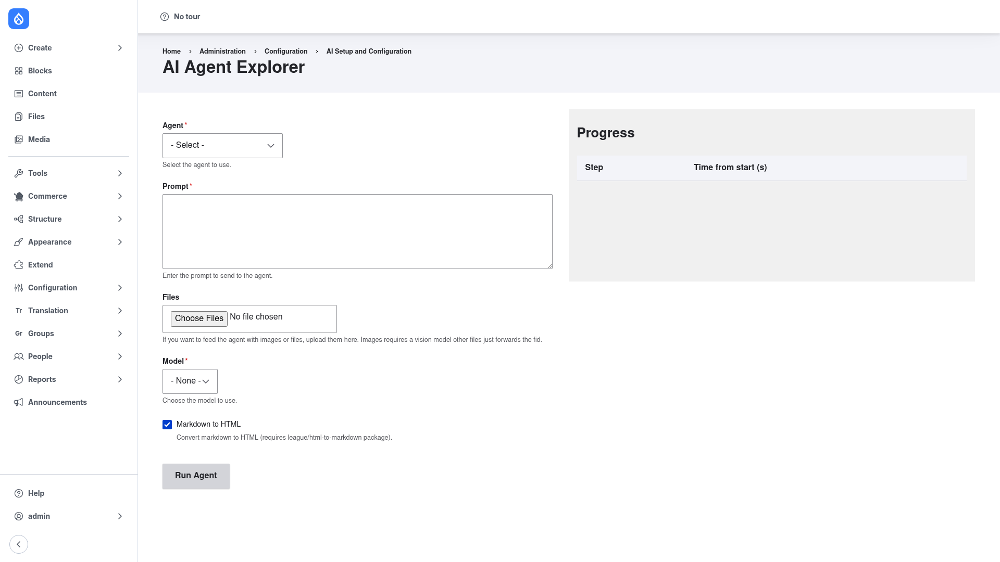

# Running an agent

The easiest way to run an agent by hand — and watch what it does — is the **AI Agent
Explorer**. It gives you a form to pick an agent, type a task, run it, and see each
step the agent takes.

> **Requires the Explorer submodule.** Enable it first if you haven't:
> `drush en ai_agents_explorer -y` (see [Installation](../installation/index.md)).
> You also need a [configured provider and model](../configuration/index.md) — the
> run will fail without one.

## Open the Explorer

Go to **Configuration → AI Setup and Configuration → AI Agent Explorer**
(`/admin/config/ai/agents/explore`).

## Run a task

Fill in the form on the left:

1. **Agent** *(required)* — choose the agent to run, e.g. **Content Type Agent**.
2. **Prompt** *(required)* — describe the task in plain English. Be concrete, for
   example:

   > Create a new content type called "Recipe" with a description field and a
   > cooking‑time field in minutes.

3. **Files** *(optional)* — upload an image or file to feed the agent. Images need a
   vision‑capable model; other files are passed through by file ID.
4. **Model** *(required)* — pick the AI model the run should use.
5. **Markdown to HTML** — leave ticked to render the agent's Markdown replies as
   HTML (needs the `league/html-to-markdown` package).

Click **Run Agent**.

## Read the result

As the agent works, the **Progress** panel on the right fills in a **Step / Time from
start** table — each tool the agent calls appears as a row, so you can see exactly
what it did and how long each step took. The agent's final answer is shown below the
form when the run finishes.

Because the default agents perform *real* actions, a successful run against the
Content Type Agent above will actually create the "Recipe" content type — check
**Structure → Content types** to confirm.

## Tips

- **Start read‑only.** Ask an agent to *describe* or *list* something before asking
  it to build, to sanity‑check its understanding and your tool selection.
- **Watch the steps.** If an agent stops early or loops, the Progress table usually
  shows which tool call failed — often a missing permission or an unconfigured model.
- **Bound your agents.** Use the **Advanced settings** on the agent
  ([Creating an agent](../creating-an-agent/index.md)) to cap loops and tool usage so
  a run can't spiral.
- **Other entry points.** Beyond the Explorer, agents can be exposed as a CKEditor AI
  action, an AI Assistant action, or driven from a config form via the
  `ai_agents_form_integration` submodule.
