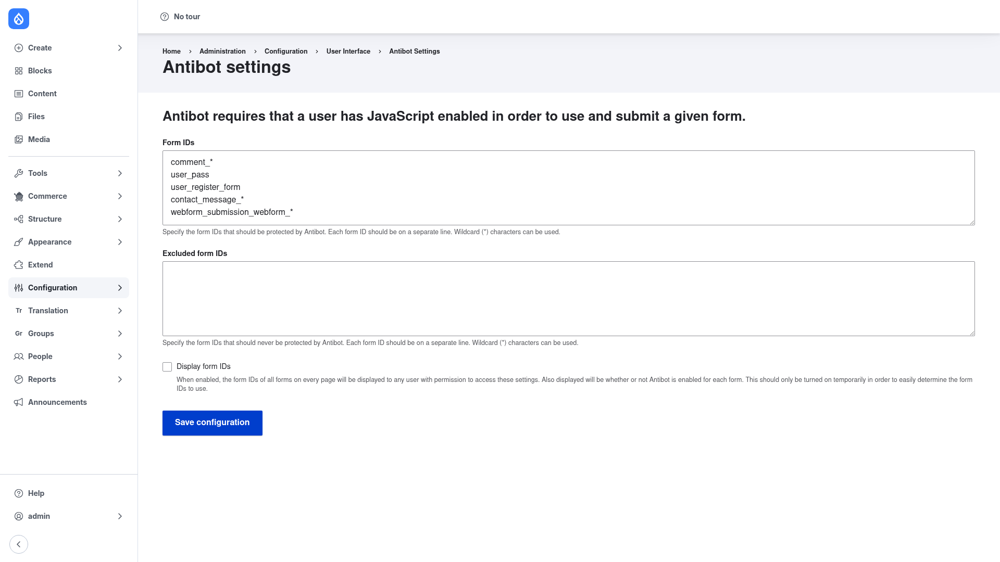

# Installation

## Requirements

Antibot runs on **Drupal 8.8 or newer, including 9, 10, and 11**
(`drupal/core: ^8.8 || ^9 || ^10 || ^11`). It has **no other module
dependencies** and needs no external service, API key, or third-party account.

The only requirement on the visitor side is that people submitting your protected
forms have **JavaScript enabled** in their browser — that is how Antibot tells a
real visitor apart from a bot.

## Install with Composer

From the project root:

```bash
composer require drupal/antibot -W
```

The `-W` (`--with-all-dependencies`) flag lets Composer update any shared
dependencies as needed.

> **Using DDEV?** Prefix Composer and Drush with `ddev` when you run from your host
> machine — `ddev composer require drupal/antibot -W`, `ddev drush …`. Inside the
> container (`ddev ssh`) run them without the prefix.

## Enable the module

```bash
drush en antibot -y
```

## Verify it worked

Log in as an administrator and go to
`/admin/config/user-interface/antibot`. You should see the **Antibot settings**
page with a **Form IDs** box, an **Excluded form IDs** box, and a **Save
configuration** button:



If the page loads, the module is installed correctly. Next, review the
[configuration](../configuration/index.md) to choose which forms to protect.
