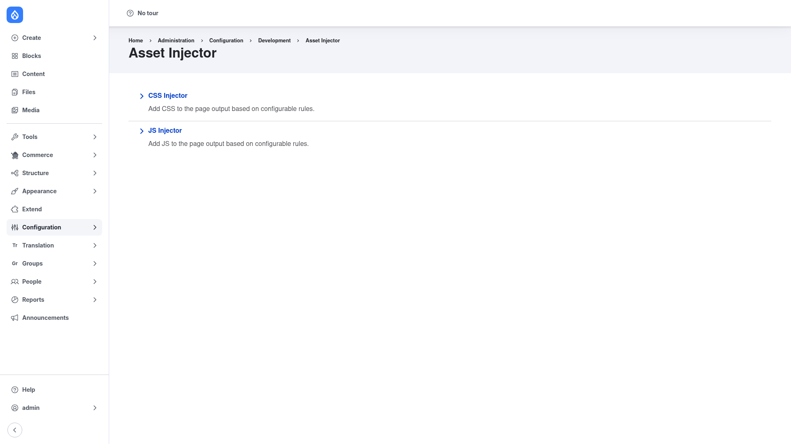

# Asset Injector — manual setup guide

**Asset Injector** (`asset_injector`) lets you add small snippets of custom CSS
or JavaScript to your site straight from the admin UI — no editing of theme files
required. Each snippet is stored as **configuration** (a config entity), so it
exports and deploys alongside the rest of your site's config, and each one can be
attached **conditionally** — only on certain paths, content types, roles, or
themes. It is a quick way to apply a style fix, drop in a third-party script
(analytics, chat widget, cookie banner), or prototype a tweak before committing it
to a real theme.

This guide is written for a **human** clicking through the admin UI. It walks you,
step by step and with screenshots, from installing the module to creating your
first CSS or JS injector. If you are looking for terse, token-cheap references for
an AI coding agent, read the sibling [`agent/`](../agent/start.md) docs instead.

## Where it lives in the admin menu

Everything in this guide sits under **Configuration → Development → Asset
Injector** (`/admin/config/development/asset-injector`). That landing page offers
two collections:

- **CSS Injector** — "Add CSS to the page output based on configurable rules."
- **JS Injector** — "Add JS to the page output based on configurable rules."

Each collection lists the snippets you have created and gives you a button to add
a new one.

## Contents

1. [Installation](installation/index.md) — install Asset Injector with Composer
   and enable it.
2. [Configuration](configuration/index.md) — add a CSS or JS injector, paste your
   code, set the conditions that control where it loads, and export it as config.
