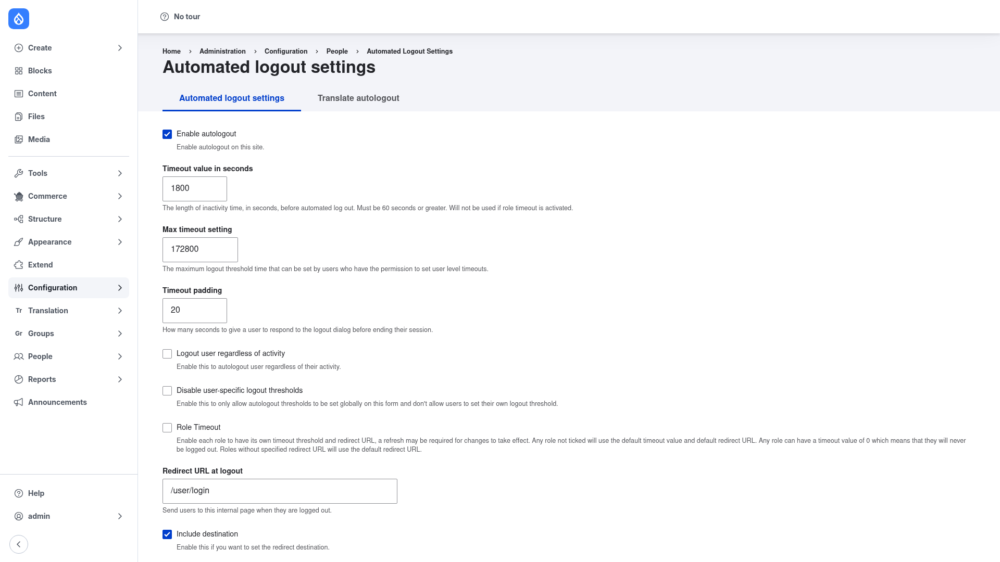

# Automated Logout — manual setup guide

**Automated Logout** (`autologout`) logs users out after a configurable period
of inactivity. Before the session ends it can show a warning dialog with a
live countdown and **Yes/No** buttons, so an active user can choose to stay
logged in. This makes it a common choice for security and compliance on shared,
kiosk, or otherwise sensitive sites where an abandoned session must not be left
open.

A JavaScript timer runs in the browser and periodically checks in with the
server to keep an active session alive and to fetch the remaining time; when the
timer expires the module ends the session server-side and (optionally) redirects
the user. Timeouts can be applied globally to the whole site, or they can vary
**per role** — for example a short timeout for editors and a longer one for
administrators — and trusted users can even be allowed to set their own
threshold.

This guide is written for a **human** clicking through the admin UI. It walks
you, step by step and with a screenshot, from installing the module to tuning
the timeout and warning message. If you are looking for terse, token-cheap
references for an AI coding agent, read the sibling [`agent/`](../agent/start.md)
docs instead.

## Where it lives in the admin menu

Everything in this guide lives on a single settings form at **Configuration →
People → Automated logout** (`/admin/config/people/autologout`). Changing these
options requires the **Administer autologout** permission.

## Contents

1. [Installation](installation/index.md) — install Automated Logout with Composer
   and enable it.
2. [Configuration](configuration/index.md) — set the inactivity timeout, the
   warning dialog, the redirect URL, and per-role timeouts on the settings form.
