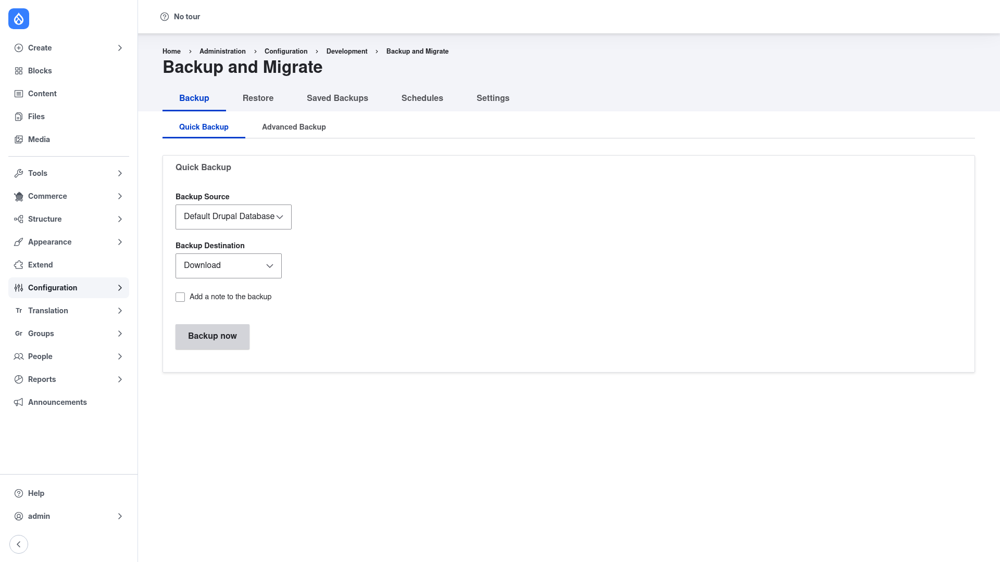

# Installation

## Requirements

Backup and Migrate needs **Drupal 9.5, 10, or 11** (core version requirement
`^9.5 || ^10 || ^11`). It has **no other module dependencies** — nothing extra is
pulled in when you install it.

Optional:

- **`defuse/php-encryption`** — a PHP library that enables optional **encryption**
  of saved backup archives. Install it only if you want encrypted backups; it is
  not required for normal use.

## Install with Composer

From the project root:

```bash
composer require drupal/backup_migrate -W
```

The `-W` (`--with-all-dependencies`) flag lets Composer update any shared
dependencies as needed.

> **Using DDEV?** Prefix Composer and Drush with `ddev` when you run from your host
> machine — `ddev composer require drupal/backup_migrate -W`, `ddev drush …`.
> Inside the container (`ddev ssh`) run them without the prefix.

## Enable the module

```bash
drush en backup_migrate -y
```

Once enabled, the backup screens appear under **Configuration → Development →
Backup and Migrate** (`/admin/config/development/backup_migrate`).

## Verify it worked

Log in as an administrator and go to
`/admin/config/development/backup_migrate`. You should land on the **Backup** tab
with its **Quick Backup** form:



If the page loads and the tabs (Backup, Restore, Saved Backups, Schedules,
Settings) are present across the top, the module is installed correctly. Next,
head to [Configuration](../configuration/index.md) to take your first backup.
