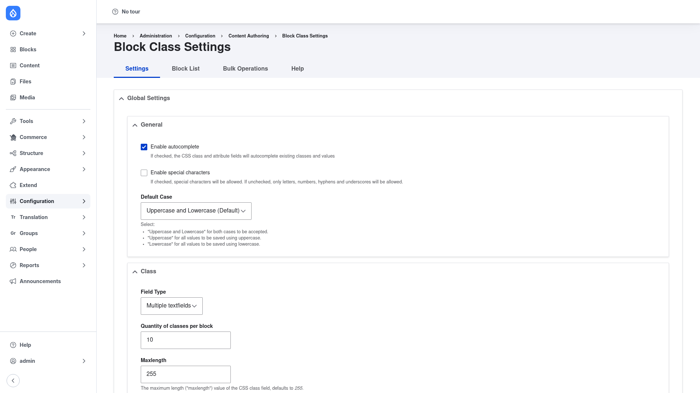

# Installation

## Requirements

Block Class runs on **Drupal 9, 10, or 11** (core version requirement
`^9 || ^10 || ^11`). Its only dependency is core's own **Block** module
(`block`), which ships with Drupal, so there is nothing extra to download.

## Install with Composer

From the project root:

```bash
composer require drupal/block_class -W
```

The `-W` (`--with-all-dependencies`) flag lets Composer update any dependencies as
needed while it adds the module.

> **Using DDEV?** Prefix Composer and Drush with `ddev` when you run them from your
> host machine — `ddev composer require drupal/block_class -W`, `ddev drush …`.
> Inside the container (`ddev ssh`) run them without the prefix.

## Enable the module

```bash
drush en block_class -y
```

This also enables core's **Block** module if it is not already on. Once the module
is enabled, the settings screen appears under **Configuration → Content authoring
→ Block Class** (`/admin/config/content/block-class/settings`).

## Verify it worked

Log in as an administrator and go to
`/admin/config/content/block-class/settings`. You should see the **Block Class
Settings** page with its **Settings**, **Block List**, **Bulk Operations**, and
**Help** tabs:



If the page loads and the tabs are present, the module is installed correctly.
Next, review the [global settings](../configuration/index.md) and add your first
class to a block.
