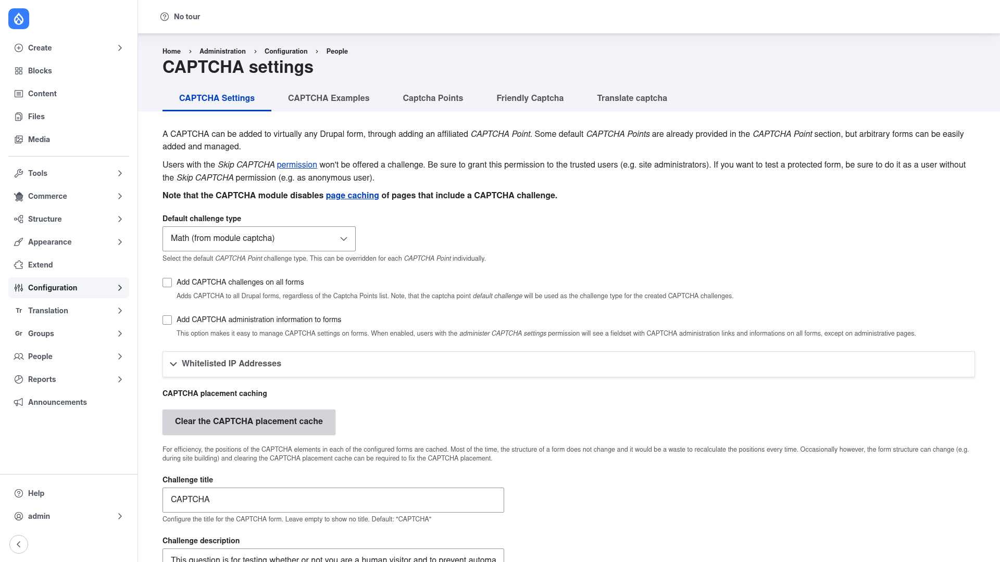

# Configuration — the CAPTCHA settings page

The CAPTCHA settings page controls the module's global behaviour: which challenge is
used by default, whether every form is protected, how often a user has to re‑solve a
challenge, which IPs are exempt, and the wording shown around the challenge. Nothing
here decides *which individual forms* are protected — that is done with CAPTCHA
points on the next tab (see [Protecting a form](../protecting-a-form/index.md)).

## Open the settings page

Go to **Configuration → People → CAPTCHA module settings**
(`/admin/config/people/captcha`). You land on the **CAPTCHA Settings** tab:

The top of the page reminds you of two important facts:

- Users with the **Skip CAPTCHA** permission are never shown a challenge — so grant
  that permission to trusted roles (e.g. site administrators), and test protected
  forms as a user *without* it (e.g. anonymous).
- The module **disables page caching** for any page that contains a CAPTCHA
  challenge, because each challenge must be freshly generated.

## Fill in the settings

Work down the form:

1. **Default challenge type** — the challenge used by any CAPTCHA point set to
   *default*. Out of the box this is **Math (from module captcha)**. If you enabled
   the Image CAPTCHA submodule you can pick the image challenge here instead; if you
   installed reCAPTCHA it appears in this list too. Changing this value instantly
   changes every form whose CAPTCHA point is set to *default*.

2. **Add CAPTCHA challenges on all forms** — a single checkbox that switches on
   global protection: CAPTCHA is added to *every* Drupal form, regardless of the
   CAPTCHA points list, using the default challenge type above. Leave it unchecked if
   you only want to protect specific forms.

3. **Add CAPTCHA administration information to forms** — when checked, users with the
   *administer CAPTCHA settings* permission see an inline CAPTCHA administration
   fieldset directly on each form (on non‑admin pages). This is the fastest way to
   discover a form's ID and add or change its challenge without hunting through the
   CAPTCHA points list — see [Protecting a form](../protecting-a-form/index.md).

4. **Whitelisted IP Addresses** — expand this section to enter IP addresses or CIDR
   ranges (one per line) that should bypass the challenge entirely. Useful for office
   networks or monitoring services.

5. **CAPTCHA placement caching** — the module remembers where in each form the
   challenge should be injected. If you rebuild a form and the CAPTCHA ends up in the
   wrong place, click **Clear the CAPTCHA placement cache** to recalculate.

6. **Challenge title** — the heading shown above the challenge (default: *CAPTCHA*).
   Leave empty to show no title.

7. **Challenge description** — the explanatory text under the title (the default
   explains that the question weeds out automated spam).

Further down the form (below the fold of the screenshot) you will also find:

- **Default validation** — whether answers are matched case‑sensitively or
  case‑insensitively.
- **Persistence** — how often a visitor must re‑solve a challenge: always, once per
  form instance, once per form type, or once anywhere on the site per session.
- **Wrong CAPTCHA response message** — the error shown when someone answers
  incorrectly.
- **Statistics / logging** — optionally count generated and blocked challenges, and
  log incorrect responses to the site log, to spot bot activity.

Click **Save configuration** to store your changes.

## Verify

After saving, the values you set take effect immediately on every protected form. To
prove a challenge appears, open a protected form (for example the user login page) in
a private/incognito window, or as an anonymous user, and confirm the CAPTCHA question
is shown. Next, decide exactly which forms to protect in
[Protecting a form](../protecting-a-form/index.md).
