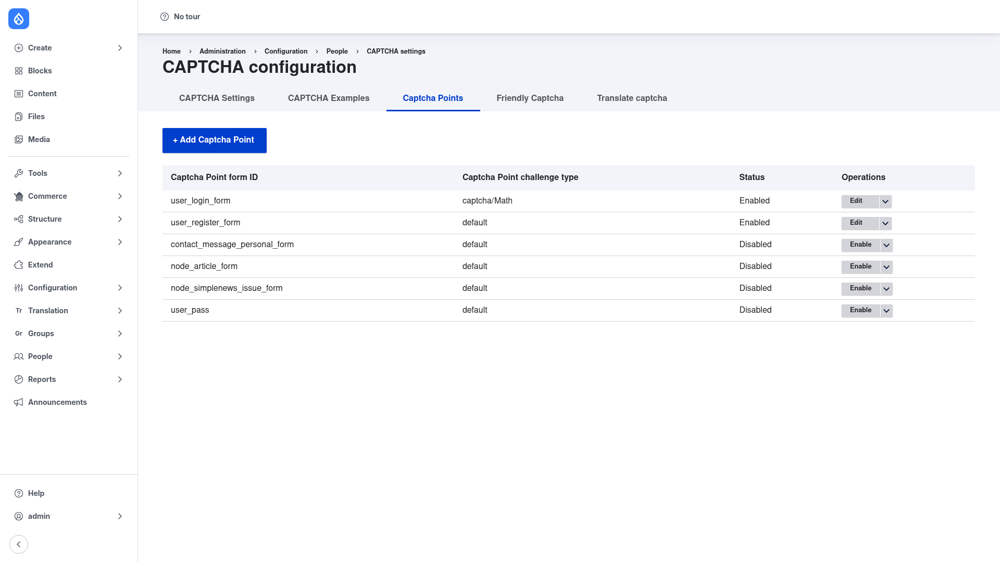

# Protecting a form

You choose which forms get a challenge by creating **CAPTCHA points**. A CAPTCHA
point is a small piece of configuration that maps one Drupal form — identified by its
**form ID**, e.g. `user_login_form` or `contact_message_feedback_form` — to a
challenge type. A point can be **Enabled** (the form is protected) or **Disabled**
(no challenge), and its challenge can be either a specific type or *default* (which
follows the *Default challenge type* you set in
[Configuration](../configuration/index.md)).

## Open the CAPTCHA points list

Go to **Configuration → People → CAPTCHA module settings** and click the **Captcha
Points** tab (`/admin/config/people/captcha/captcha-points`). The page — titled
**CAPTCHA configuration** — lists every known point:

Each row shows four things:

- **Captcha Point form ID** — the machine form ID being protected, e.g.
  `user_login_form`, `user_register_form`, `contact_message_personal_form`,
  `node_article_form`, `user_pass`.
- **Captcha Point challenge type** — either a specific challenge such as
  `captcha/Math`, or **default** (use whatever the settings page's default challenge
  type is).
- **Status** — **Enabled** (protected) or **Disabled** (present but inactive).
- **Operations** — an **Edit** button for enabled points and an **Enable** button for
  disabled ones, with a dropdown for the remaining actions (disable, delete).

The module ships with points already created for the common user forms. In the
screenshot, `user_login_form` (challenge `captcha/Math`) and `user_register_form`
(challenge `default`) are **Enabled**, while `contact_message_personal_form`,
`node_article_form`, `node_simplenews_issue_form`, and `user_pass` are present but
**Disabled** — ready to switch on.

## Turn on an existing point

To protect one of the forms already listed:

1. Find its row (e.g. `user_pass`, the password‑reset form).
2. In the **Operations** column, click **Enable**.

The status flips to **Enabled** and the form is now protected using its listed
challenge type. To change *which* challenge it uses, click the dropdown next to the
button and choose **Edit** (or click **Edit** on an already‑enabled row), then pick a
different challenge type and save.

## Add a challenge to a form that isn't listed

If the form you want to protect isn't in the list:

1. Click **+ Add Captcha Point** at the top of the page.
2. Enter the **Form ID** of the form you want to protect.
3. Choose the **Challenge type** — a specific type, or *default* to follow the global
   default challenge.
4. Save. The new point appears in the list, Enabled.

### Finding a form's ID the easy way

The hardest part is usually knowing a form's exact ID. The module gives you a
shortcut: on the [CAPTCHA settings](../configuration/index.md) page, tick **Add
CAPTCHA administration information to forms**. With that on, any user who has the
*administer CAPTCHA settings* permission sees a small CAPTCHA administration fieldset
rendered directly on each form (on non‑admin pages). That fieldset shows the form's
ID and lets you add or change its challenge right there — no need to guess the ID or
come back to this list. Once you know the ID, you can add or edit the point here.

## Protecting every form at once

If you would rather protect *all* forms rather than pick them individually, skip
CAPTCHA points and instead tick **Add CAPTCHA challenges on all forms** on the
[CAPTCHA settings](../configuration/index.md) page. Every form then gets the default
challenge, and the CAPTCHA points list becomes a set of per‑form overrides.

## Verify

Open a protected form as a user *without* the **skip CAPTCHA** permission — the
simplest test is an anonymous/incognito window on the user login page — and confirm
the challenge appears above the submit button. Remember that administrators usually
hold **skip CAPTCHA**, so they will not see the challenge themselves.
