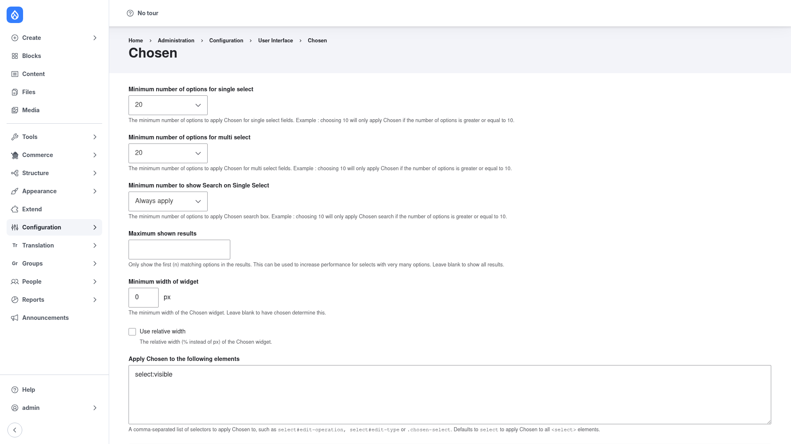

# Configuration

Chosen is controlled entirely from one settings form. These options decide *when*
Chosen replaces a native `<select>` (how many options it must have), *how* the
enhanced widget looks and searches, *which* elements on the page are targeted, and
*where* on the site it runs. The defaults are sensible, but it is worth
understanding each field before you turn Chosen loose on your forms.

## Open the settings form

1. Go to **Configuration → User interface → Chosen**
   (`/admin/config/user-interface/chosen`).

## Option thresholds — when Chosen kicks in

Chosen does not need to enhance every dropdown; a select with three options is fine
as-is. These fields set the point at which Chosen takes over:

- **Minimum number of options for single select** — Chosen is applied to a
  single-value `<select>` only once it has at least this many options. The default
  is **20**. For example, choosing *10* applies Chosen only when the select has 10
  or more options.
- **Minimum number of options for multi select** — the same threshold, applied to
  multi-value selects. Default **20**.
- **Minimum number to show Search on Single Select** — controls when the
  type-to-search box appears on single selects. The default, **Always apply**,
  always shows the search box; choosing a number (for example *10*) shows the
  search box only when the select has that many options or more, so short lists
  stay simple.

## Result and width options

- **Maximum shown results** — cap how many matching options Chosen displays in the
  results list. This improves performance for selects with very many options.
  Leave it **blank** to show all matching results.
- **Minimum width of widget** — the minimum width of the enhanced Chosen widget, in
  pixels. The default is **0**; leave it blank (or 0) to let Chosen size the widget
  itself.
- **Use relative width** — tick this to interpret the width as a percentage (`%`)
  rather than pixels (`px`), so the widget scales with its container.

## Which elements Chosen targets

- **Apply Chosen to the following elements** — a comma-separated list of jQuery
  selectors that decide which `<select>` elements Chosen attaches to. The default,
  **`select:visible`**, targets every visible select on the page. You can narrow
  this to specific elements — for example `select#edit-operation`,
  `select#edit-type`, or a class like `.chosen-select` — or use plain `select` to
  match all `<select>` elements. Editing this box is how you include or exclude
  particular selects from Chosen.

## Save

Click **Save configuration** at the bottom of the form. Your changes take effect
immediately for pages rendered after the save. Load a form that contains a long
select — a taxonomy term reference or a country list, for instance — and confirm
the native dropdown is now a searchable Chosen widget.
