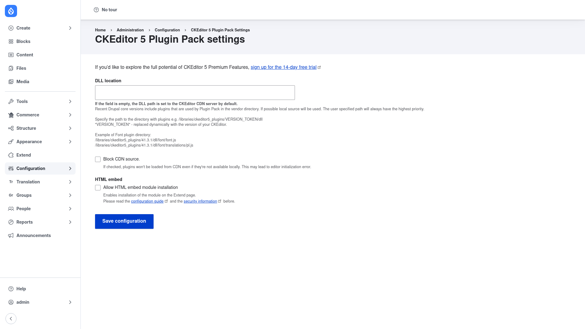

# Configuration

Configuring CKEditor 5 Plugin Pack happens in two places:

1. The **global settings page**, which controls where the CKEditor library assets
   are loaded from and points you at premium features.
2. The **text format toolbars**, where you actually add the new buttons so
   editors can use them.

The first page you rarely need to touch; the second is the real day-to-day
workflow. Both are covered below.

## Part 1 — the global settings page

### Open the settings page

1. Go to **Configuration → CKEditor 5 Plugin Pack settings**
   (`/admin/config/ckeditor5-plugin-pack`). Access requires the *administer site
   configuration* permission.

### The fields on this page

- **Premium features trial link.** At the top, a message —
  *"If you'd like to explore the full potential of CKEditor 5 Premium Features,
  sign up for the 14-day free trial"* — links out to CKEditor. Premium plugins
  need a **license key** obtained through the CKEditor 5 Premium Features module.
  Treat that key as a secret and keep it out of committed configuration (store it
  in an environment variable or a Key entity). This settings page itself does not
  ask for the key.

- **DLL location.** The path to the directory that holds the CKEditor 5 library
  ("DLL") assets. Leave it **empty** to use the default CKEditor CDN. Recent
  Drupal core versions already ship the plugins Plugin Pack uses in the vendor
  directory, and a local source is used when available; any path you enter here
  takes the highest priority. To self-host, point it at your plugins directory,
  for example `/libraries/ckeditor5_plugins/VERSION_TOKEN/dll` — the
  `VERSION_TOKEN` placeholder is replaced dynamically with your CKEditor version.

- **Block CDN source.** When ticked, plugins are **never** loaded from the CDN,
  even if they are not available locally. Use this on compliance or offline sites
  that must self-host every asset — but be aware that if a required plugin is not
  present locally it can lead to an editor initialization error, so pair it with a
  correct **DLL location**.

- **HTML embed → Allow HTML embed module installation.** Enables installation of
  the HTML embed module from the **Extend** page. Because embedding raw HTML has
  security implications, the on-page links to the configuration guide and security
  information are worth reading before you turn this on.

### Save

Click **Save configuration** at the bottom. For most sites the defaults (empty
DLL location, CDN allowed) are correct and you can move straight on to adding
buttons.

## Part 2 — add Plugin Pack buttons to a text format

Enabling a submodule (see [Installation](../installation/index.md)) makes its
buttons *available*, but editors will not see them until you place them in a text
format's active toolbar. This is the step that actually turns a feature on for
your authors.

1. Go to **Configuration → Content authoring → Text formats and editors**
   (`/admin/config/content/formats`). You will see a list of your text formats,
   such as *Basic HTML* and *Full HTML*.
2. Find a format that uses **CKEditor 5** as its editor and click **Configure**
   next to it. (If a format uses a different editor, switch its *Text editor* to
   CKEditor 5 first, or pick a different format.)
3. On the format's edit page, look at the **Toolbar configuration**. It shows two
   rows of buttons: the **Active toolbar** (what editors see) on top, and a set of
   **Available buttons** below it.
4. Find the new Plugin Pack buttons in the *Available buttons* row — for example
   the font, highlight or find & replace controls you enabled — and **drag** each
   one up into the *Active toolbar*, dropping it where you want it to appear. Use
   the divider and wrapping controls to organise the toolbar as needed.
5. Some features are **passive** and do not need a button. Word count, for
   instance, simply appears beneath the editor once its submodule is enabled.
6. A few buttons expose their own options in the **plugin settings** vertical tabs
   further down the page (for example the set of highlight colors). Adjust those
   if the feature offers them.
7. Click **Save configuration**.

To confirm it worked, edit any content that uses this text format and open the
editor: the buttons you dragged in should now appear in the toolbar, ready to use.
Repeat for each text format where you want the same tools available.
