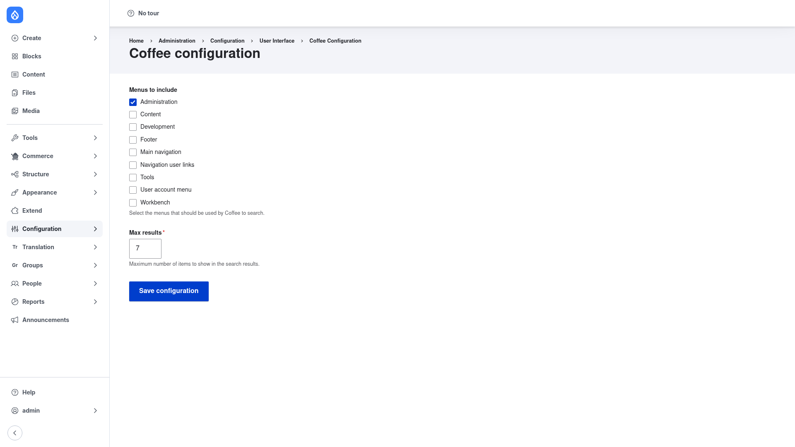

# Configuration and usage

Coffee has a single, short settings page that controls **which menus** the search
box can navigate to and **how many results** it shows at a time. This page walks
through each setting and then shows you how to actually use the search box once it
is configured.

## Open the settings page

1. Go to **Configuration → User interface → Coffee**
   (`/admin/config/user-interface/coffee`). Opening this page requires the
   **Administer Coffee** permission.

## Menus to include

The **Menus to include** checkboxes decide which of the site's menus Coffee indexes
and searches. Only items that live in a ticked menu can be found in the search box,
so this is where you tune the scope of what Coffee can reach. The menus offered
depend on what your site has, but typically include:

- **Administration** — the main admin menu (People, Content, Modules, Configuration,
  and so on). This is ticked by default and is the one most sites want.
- **Content** — links from the Content administration area.
- **Development**, **Tools**, **Workbench** — utility and workflow menus, if present.
- **Footer**, **Main navigation**, **Navigation user links**, **User account menu** —
  front-end and account menus, in case you want front-facing destinations searchable
  too.

Tick every menu whose pages you want to be able to jump to. The help text under the
list reads *"Select the menus that should be used by Coffee to search."* For most
sites, leaving **Administration** ticked is enough; add others only if you regularly
navigate to pages that live in them.

## Max results

**Max results** sets the maximum number of items shown in the search overlay at once
(the default is **7**). If you type something that matches more destinations than
this, Coffee shows only the top matches — keep the number small enough that the list
stays scannable, but large enough to surface the page you want. This field is
required.

## Save

Click **Save configuration** to store your choices. The settings are saved as
Drupal configuration, so you can export them (`drush config:export`) and deploy them
to other environments like any other config.

## Using the search box

Once Coffee is configured and your role has the **Access Coffee** permission, you
can use it from anywhere in the admin interface:

1. **Open the search box.** Press the keyboard shortcut — by default **Alt + D**
   (**Ctrl + D** / **Alt + K** / **Ctrl + K** also work as alternatives). A search
   overlay appears in the middle of the screen. You can also open it by clicking the
   **Coffee** link that the module adds to the admin toolbar.
2. **Type the name of a page.** Start typing what you are looking for — a page title
   such as `people`, `modules`, or `add article`. Coffee filters the destinations
   from the menus you enabled above and shows up to your **Max results** matches.
3. **Choose a result.** Use the arrow keys to highlight the destination you want, or
   keep typing to narrow the list further.
4. **Go.** Press **Enter** to navigate straight to the highlighted page.

That's the whole workflow: shortcut, type, Enter. Because Coffee only navigates —
it never edits content — you can use it freely to move around the admin interface as
fast as you can type.
