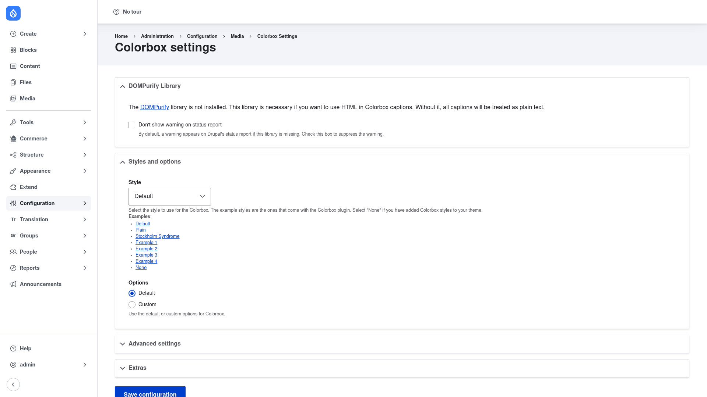

# Configuration

Colorbox has two halves. First you set the **global lightbox style and behaviour**
on the Colorbox settings page — this applies everywhere the lightbox appears.
Then, for each field you want to lightbox, you switch that field's **display
formatter** to Colorbox. This page covers both.

## Open the Colorbox settings page

1. Go to **Configuration → Media → Colorbox** (`/admin/config/media/colorbox`).
2. The **Colorbox settings** page opens with everything in one form, grouped into
   collapsible sections.

## Choose the style (theme)

Under **Styles and options**, the **Style** dropdown picks the visual theme used
for the lightbox chrome (the frame, buttons and background around your image).
These are the example styles that ship with the Colorbox plugin:

- **Default** — the standard Colorbox look.
- **Plain** — a minimal, unstyled frame.
- **Stockholm Syndrome** — an alternative bundled theme.
- **Example 1**–**Example 4** — further sample styles from the library.
- **None** — loads no Colorbox theme CSS at all. Choose this when you have added
  your own Colorbox styles to your theme and want to style the lightbox yourself.

The links listed under **Examples** below the dropdown let you preview each style
before committing. Pick a style and it takes effect site-wide once you save.

## Default vs. custom options

Below the style is an **Options** choice with two radio buttons:

- **Default** — use Colorbox's built-in behaviour. Leave this selected if you just
  want a working lightbox with sensible defaults.
- **Custom** — reveal the full set of behaviour options so you can override them.

Select **Custom** when you want to change any of the following (they appear once
Custom is chosen):

- **Transition** — how the lightbox animates in: *elastic* (the default), *fade*,
  or *none* — plus a transition speed in milliseconds.
- **Dimensions and opacity** — the modal's maximum width and height (expressed as
  percentages so it fits any viewport), its initial size, and the opacity of the
  dimmed page behind it.
- **Navigation text** — the labels used for the *Prev*, *Next*, *Close* controls
  and the "{current} of {total}" counter.
- **Slideshow** — turn a gallery into an auto-advancing slideshow, with its own
  start/stop labels and an advance speed. Off by default.
- **Close behaviour** — whether clicking the dimmed overlay closes the lightbox.

Two further collapsible sections hold less-common options:

- **Advanced settings** — gallery-token behaviour, mobile handling (Colorbox can be
  disabled below a screen-width threshold for touch devices), caption trimming to a
  configurable length, and whether to load the minified or development build of the
  library.
- **Extras** — additional tweaks exposed by the module.

## Save

Click **Save configuration** at the bottom. Your choices apply everywhere the
lightbox is used from that point on.

## Turn on Colorbox for an image field

Setting the global style does **not**, on its own, make any image open in a
lightbox — you have to point a field's display at the Colorbox formatter. To do
that for a content type:

1. Go to **Structure → Content types**, find your content type, and open its
   **Manage display** tab (for example
   `/admin/structure/types/manage/article/display`).
2. Find the row for your image field.
3. In that row's **Format** column, change the dropdown from the current format
   (such as *Image*) to **Colorbox**.
4. Click the gear/settings icon at the end of the row to open the formatter's
   options. Here you choose:
   - The **thumbnail** image style — the smaller image shown on the page that the
     visitor clicks.
   - The **full/lightbox** image style — the larger image shown inside the modal.
   - **Gallery** grouping — whether images are grouped per field, per post, or by a
     custom token, which controls what the Prev/Next navigation steps through.
   - The **caption** source shown under the image in the lightbox.
5. Click **Update**, then **Save** at the bottom of the Manage display page.

Colorbox also provides two related formatters for other cases: **Colorbox
(responsive)** for image fields that use a responsive image style, and a
view-mode formatter that opens a referenced entity inside the modal for
entity-reference fields.

Once saved, visit a piece of that content and click the image — it should open in
the overlay instead of loading a new page. A multi-value image field renders as a
gallery you can page through with the Prev/Next controls.
