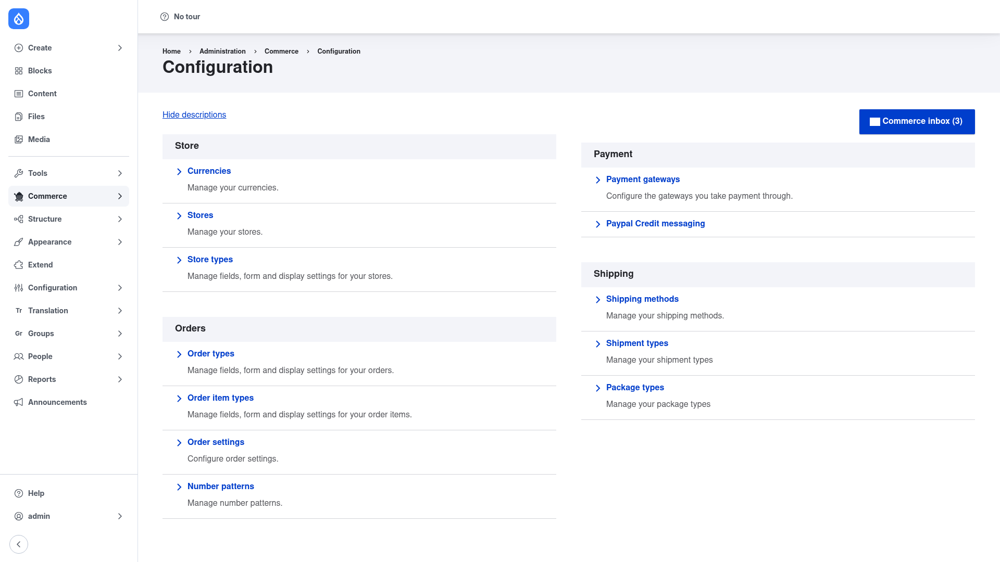

# Drupal Commerce — manual setup guide

**Drupal Commerce** (`commerce`) is a full e-commerce framework for Drupal. It
lets you build a complete online store — **Stores**, **Products** (with
variations and attributes), **Orders**, **Checkout**, **Payments**, **Taxes**
and **Promotions** — all modelled as native Drupal entities, so everything you
already know about fields, view modes, permissions and Views applies to your
shop as well.

Rather than one monolith, Commerce ships as a package of cooperating submodules
— `commerce_store`, `commerce_product`, `commerce_order`, `commerce_cart`,
`commerce_checkout`, `commerce_payment`, `commerce_price`, `commerce_tax`,
`commerce_promotion` and more. The base `commerce` module supplies the shared
plumbing they build on and adds a single **Commerce → Configuration** hub where
all of it is set up.

This guide is written for a **human** clicking through the admin UI. Commerce is
large, so this is not an exhaustive feature tour: it covers getting the module
installed, finding your way around the configuration hub, and walking through a
first store, product and payment gateway. If you are looking for terse,
token-cheap references for an AI coding agent, read the sibling
[`agent/`](../agent/start.md) docs instead.

## Where it lives in the admin menu

Everything in this guide sits under **Commerce → Configuration**
(`/admin/commerce/config`). That page is an overview hub whose links are grouped
into areas — Store, Orders, Payment and more — each pointing at the form for one
part of your shop:

## Contents

1. [Installation](installation/index.md) — install Commerce with Composer and
   enable the submodules you need.
2. [Configuration](configuration/index.md) — a click-by-click tour of the
   Commerce configuration hub and the recommended order for setting up your
   first store, product and payment gateway.
