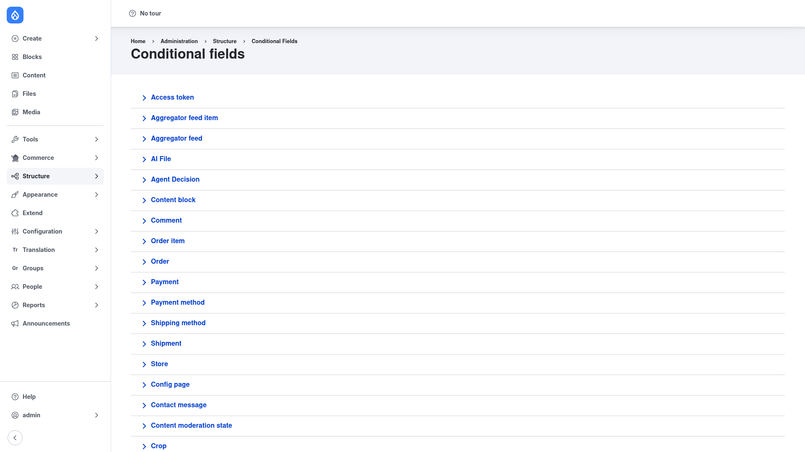

# Configuration — add a field dependency

There is no global settings screen to configure: you work directly with the field
dependencies on each entity bundle. This page walks you through creating one
dependency from start to finish.

## The four things every dependency needs

Before you click anything, it helps to know the vocabulary used throughout the UI:

- **Dependent field** — the *target*. This is the field that reacts: it gets shown,
  hidden, required, disabled or filled in.
- **Controlling field** — the field that *drives* the behaviour. Conditional Fields
  watches this field's value and applies the state to the dependent field
  accordingly.
- **State** — *what happens* to the dependent field when the condition is met.
  Common states are **Visible/Invisible**, **Required/Optional**,
  **Enabled/Disabled**, **Filled/Empty** and **Checked/Unchecked**.
- **Condition** — *the trigger* on the controlling field that switches the state on.
  Typical triggers are **Value** (the field equals a value you specify),
  **Checked** (a checkbox is ticked) and **Filled** (the field has any value).

The most common pattern is **"show X when Y = value"**: X is the dependent field,
Y is the controlling field, the state is *Visible*, and the condition is *Value*
matching whatever value should reveal X.

## Step by step

### 1. Open the Conditional fields page

Go to **Structure → Conditional fields**
(`/admin/structure/conditional_fields`). You will see a list of every entity type
on the site.

### 2. Pick the entity type and bundle

Click the entity type whose form you want to control (for example **Content
block**, **Comment**, or a content type such as Article). Then choose the specific
**bundle** within it. This opens that bundle's conditional-fields form, where all
of its dependencies are managed.

> **Shortcut:** every bundle also has a **Manage Dependencies** tab on its own
> configuration page, which opens exactly the same form.

### 3. Add a dependency

On the bundle's form, create the dependency by choosing:

1. The **dependent** field — the target that should react.
2. The **controlling** field — the field whose value drives the behaviour.

Save to create the dependency. This creates the link between the two fields; next
you tell Drupal exactly how they should relate.

### 4. Set the state, condition and value

Edit the dependency you just created and configure:

- **State** — pick what should happen to the dependent field, e.g. **Visible**
  (show it), **Required** (force a value), **Disabled**, or **Filled**.
- **Condition** — pick the trigger on the controlling field: **Value** (matches a
  value you enter), **Checked** (a checkbox is ticked), or **Filled** (any value
  present).
- **Value** — when the condition is *Value*, enter the value (or values) that
  should switch the state on. Multiple values can be combined with **AND**, **OR**,
  **XOR** or **NOT** logic, or matched with a regular expression.

For show/hide states you can also choose an **effect** — a plain **Show/Hide**, or
a **fade** or **slide** animation.

### 5. Save

Save the dependency. The rule now applies on that bundle's add and edit forms:
when an editor opens the form, the dependent field appears, hides, becomes
required or fills in automatically as they change the controlling field.

## A worked example: "show X when Y = value"

Say an Article has a **Reason** text field that should only appear when a
**Status** select list is set to "Rejected":

1. Go to **Structure → Conditional fields**, click **Article** and open its
   dependencies form.
2. Set the **dependent** field to **Reason** and the **controlling** field to
   **Status**, then save.
3. Edit the dependency: set the **State** to **Visible**, the **Condition** to
   **Value**, and enter `Rejected` as the value.
4. Save. On the Article form, the Reason field now stays hidden until an editor
   picks "Rejected" in the Status list.
