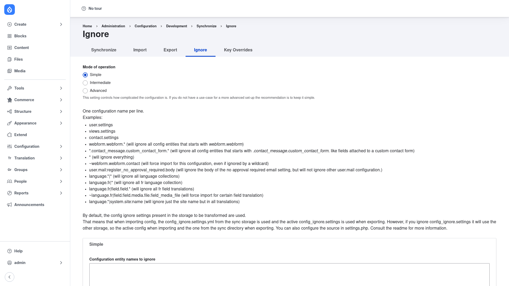

# Configuration — listing what to ignore

The **Ignore** tab is where you tell Config Ignore which configuration to leave
alone. Every name you list here is skipped when configuration is imported, so the
value already active on the site is kept instead of being overwritten by the sync
folder. This is how you keep per-environment values — API keys, the site name and
email, development-only module settings — surviving a `drush config:import` or a
deployment.

## Open the Ignore tab

1. Go to **Configuration → Development → Configuration synchronization**
   (`/admin/config/development/configuration`).
2. Click the **Ignore** tab
   (`/admin/config/development/configuration/ignore`).

## Choose a mode of operation

At the top, **Mode of operation** controls how detailed your ignore rules can be.
Unless you have a specific reason to do otherwise, leave it on **Simple** — as the
form itself notes, "if you do not have a use-case for a more advanced set-up the
recommendation is to keep it simple."

- **Simple** — one ignore list, applied to both import and export.
- **Intermediate** — separate lists for import and for export, so you can ignore
  a configuration on import but still allow it on export (or vice versa).
- **Advanced** — separate lists per operation (create, update, delete) and per
  direction, for fine-grained control.

## Add configuration names to ignore

In the **Configuration entity names to ignore** textarea, enter **one
configuration name per line**. These are the same machine names Drupal uses for
config files (the filename without the `.yml`), for example `system.site` or
`user.settings`.

1. Type each configuration name on its own line.
2. Use the pattern forms below to match exact objects, groups of objects, or a
   single key.
3. Click **Save configuration**.

### How the patterns work

Config Ignore supports several pattern forms on each line:

- **Exact name** — `system.site` ignores exactly that one configuration object.
- **Wildcard `*`** — the asterisk matches any characters. `webform.webform.*`
  ignores every configuration whose name starts with `webform.webform`, and a lone
  `*` ignores *everything*. (Even with `*`, newly installed modules can still be
  installed.) You can also place the wildcard in the middle, e.g.
  `*.contact_message.custom_contact_form.*`.
- **Force-import exception `~`** — a line starting with `~` forces that
  configuration to import even if a wildcard on another line would otherwise ignore
  it. For example, `webform.webform.*` combined with `~webform.webform.contact`
  ignores all webforms *except* the contact form, which is imported normally.
  Exceptions always win over broader ignore rules.
- **Single key `name:key`** — add a colon and a key path to ignore just one value
  inside a config object rather than the whole object. For example
  `user.mail:register_no_approval_required.body` ignores only the *body* of that
  one email while still importing the rest of `user.mail`.
- **Language collections `collection|name`** — a pipe targets translation
  collections. `language.*|*` ignores all language-collection config,
  `language.fr|*` ignores everything in the French collection, and
  `language.*|system.site:name` ignores just the site name across every
  translation.

### What gets preserved

Any configuration matched by your list is **removed from the import transform**, so
Drupal never overwrites it — the value currently active on the site stays in place.
That is the whole point: the ignored configuration is treated as environment-local
and left untouched by config synchronization.

By default the ignore rules are read from the storage being transformed: on import
the `config_ignore.settings` from the **sync** directory is used, and on export the
**active** `config_ignore.settings` is used. Because the ignore list is itself
stored as configuration (`config_ignore.settings`), it can be exported and deployed
like any other config, so every environment shares the same rules.

## Save

Click **Save configuration** at the bottom. From then on, the listed configuration
is skipped whenever you import configuration — through the **Import** tab or with
`drush config:import`.
