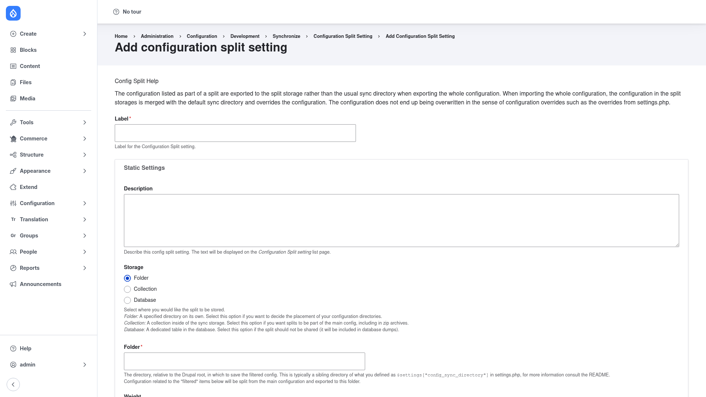

# Creating a split

A **split** is a named set of configuration that lives apart from your main sync
directory and is only active in the environments you choose. You define it once —
for example a "Development" split that carries the Devel module — and Config Split
filters it in or out as you export and import configuration. This page walks through
adding one and then activating it per environment.

## Open the add form

1. Go to **Configuration → Development → Configuration synchronization →
   Configuration Split**
   (`/admin/config/development/configuration/config-split`).
2. Click **+ Add Configuration Split setting**
   (`/admin/config/development/configuration/config-split/add`).



The form opens with a short **Config Split Help** note reminding you that the config
listed in a split is exported to the split's storage instead of the usual sync
directory, and merged back over the default config on import.

## Fill in the form

### 1. Name the split

- **Label** — a human-readable name such as `Development` or `Local overrides`. This
  is required, and Drupal derives the machine name from it (the machine name is what
  you pass to the Drush commands and to `settings.php` overrides).
- **Description** — an optional note describing what the split is for. The text is
  shown on the Configuration Split setting list page.

### 2. Choose the storage

Under **Static Settings**, the **Storage** option decides where the split's config is
kept. Pick one:

- **Folder** — a directory of its own on the filesystem. Choose this when you want to
  decide where the split's configuration directory sits. When you select Folder, a
  **Folder** field appears: enter a path relative to the Drupal root — typically a
  sibling of the directory you set as `$settings["config_sync_directory"]` in
  `settings.php` (for example `../config/dev`). The config marked as part of this
  split is written here instead of the main sync directory.
- **Collection** — a collection inside the main sync storage. Choose this when you
  want splits to travel with the main config, including inside zip archives.
- **Database** — a dedicated table in the database. Choose this when the split should
  **not** be shared — it will be included in database dumps but not in your exported
  config files. This is a good fit for per-developer local overrides.

### 3. Set the weight

- **Weight** — controls the order in which splits are applied when more than one is
  active. Lower weights are applied first. Leave the default unless you are layering
  several splits that need a specific order.

### 4. Choose what the split contains

Further down the form you decide which configuration this split carries. You can
combine any of these:

- **Modules** — select the modules whose configuration should move into the split.
  All of a chosen module's config travels together automatically. This is the usual
  way to make a module (such as Devel) present in some environments and absent in
  others.
- **Themes** — select themes whose configuration should be split out, to vary theme
  settings between environments.
- **Complete split** (a config-name list) — configuration named here is **removed
  from the main sync entirely** and stored only in the split. On environments where
  the split is inactive, this config is absent. Use a complete split for anything
  that should exist in some environments but not others — the classic case being a
  dev-only module that gets uninstalled elsewhere.
- **Conditional / partial split** (a config-name list) — configuration named here
  **stays in the main sync**, and only the per-environment *differences* are stored
  in the split as a patch and merged back on import. Use a partial split when every
  environment needs the config but with different values (for example an API key or
  a feature flag).

The difference is the key decision: a **complete** split takes config out of the
shared export, while a **conditional/partial** split keeps the shared config and
overlays only your changes.

### 5. Save

Click **Save** at the bottom of the form. The new split appears on the
[Configuration Split setting list](../configuration/index.md), where you can edit it
or run its per-split operations later.

## Activate a split per environment

Creating a split does not, on its own, decide *where* it is active. There are two
common ways to control that.

### Override the status in `settings.php`

Because a split is itself a configuration entity, you can force it on or off for a
specific environment with a standard config override. In that environment's
`settings.php` (or an environment-specific settings file):

```php
// Only on this environment, activate the "dev" split.
$config['config_split.config_split.dev']['status'] = TRUE;

// ...and make sure a "production" split is off here.
$config['config_split.config_split.production']['status'] = FALSE;
```

This is the recommended way to vary which splits apply between dev, staging, and
production — each environment's settings file switches on the splits it needs.

### Toggle the status at runtime

If you want to flip a split on or off without editing the entity or `settings.php`,
use the runtime **status override**, which is stored in state:

```bash
drush config-split:status-override dev active     # force active
drush config-split:status-override dev inactive   # force inactive
drush config-split:status-override dev none        # clear the override
```

The list page's **Current status** column reflects whichever of these overrides is
in effect. Once a split is active in an environment, run your normal
`drush config:export` to write its config into the split's storage, and
`drush config:import` on deploy to merge it back in.
