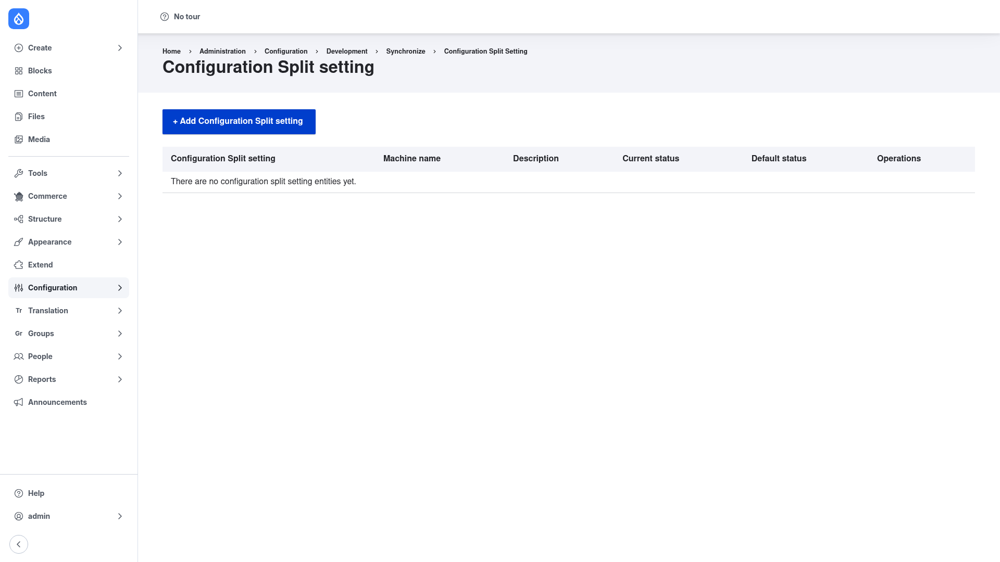

# Installation

## Requirements

Config Split runs on **Drupal 8.8, 9, 10, or 11** (`core_version_requirement:
^8.8 || ^9 || ^10 || ^11`). It has **no other module dependencies** of its own.

What it does rely on is core's **Configuration Manager** (`config`) — the module
behind Drupal's configuration synchronization screens and the `drush
config:export` / `config:import` commands. Config Split builds directly on that
system: it hooks into the normal import/export flow and filters your active splits
in and out as configuration moves through the sync directory. Make sure
Configuration Manager is enabled (it ships with Drupal core).

Two optional modules can make the split forms friendlier by improving the long
module and config `<select>` lists, but neither is required:

- **Chosen** (`drupal/chosen`)
- **Select2 all** (`drupal/select2_all`)

## Install with Composer

From the project root:

```bash
composer require drupal/config_split -W
```

The `-W` (`--with-all-dependencies`) flag lets Composer update any shared
dependencies as needed.

> **Using DDEV?** Prefix Composer and Drush with `ddev` when you run from your host
> machine — `ddev composer require drupal/config_split -W`, `ddev drush …`. Inside
> the container (`ddev ssh`) run them without the prefix.

## Enable the module

```bash
drush en config_split -y
```

Once enabled, the split screens appear under **Configuration → Development →
Configuration synchronization → Configuration Split**
(`/admin/config/development/configuration/config-split`).

## Verify it worked

Log in as an administrator and open
`/admin/config/development/configuration/config-split`. You should see the
**Configuration Split setting** list with an **+ Add Configuration Split setting**
button (the list is empty until you create your first split):



If the page loads with that button, the module is installed correctly. Next, review
how splits [participate in import and export](../configuration/index.md), then
[create your first split](../creating-a-split/index.md).
