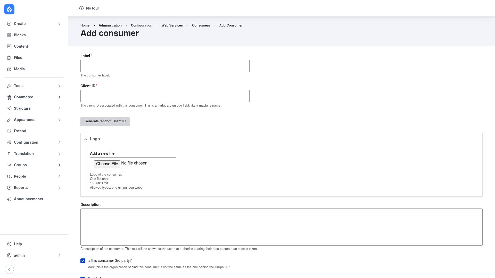

# Adding a consumer

Registering a consumer tells your site about one client application — a mobile
app, a single-page front end, or a third-party service — and gives it the
identity it will use when calling the API. This page walks through the **Add
consumer** form field by field.

## Open the Add consumer form

1. Go to **Configuration → Web services → Consumers**
   (`/admin/config/services/consumer`).
2. Click **+ Add Consumer**. This opens the form at
   `/admin/config/services/consumer/add`.

## Fill in the form

Work down the form in order:

1. **Label** *(required)* — a human-readable name for the client application,
   for example *iOS App* or *Marketing Website*. This is the name that appears
   in the Consumers list.

2. **Client ID** *(required)* — the identifier the client sends so the site can
   recognise which consumer is making a request. It is an arbitrary unique value,
   much like a machine name. You can type your own, or click **Generate random
   Client ID** to have one created for you. If you use confidential clients (see
   below), this client ID is paired with a secret.

3. **Logo** — optionally upload an image to represent the client app (PNG, GIF,
   JPG, JPEG, or WEBP). This is useful when you present a catalogue of the apps
   that use your API.

4. **Description** — free text describing the client. When the consumer is used
   in an OAuth flow, this text can be shown to users on the screen where they
   authorise the app to access their data.

5. **Is this consumer 3rd party?** — tick this if the organisation behind the
   client is *not* the same as the one behind your Drupal API. It marks the
   consumer as an external, third-party integration.

Below these fields the form also lets you set whether the consumer is
**enabled** (its active/disabled status).

## Client secret, roles, scopes and redirect URIs

The base Consumers module stores a client's identity — its label, client ID,
logo, and flags. The security-related settings you typically need for an OAuth
client are added by **Simple OAuth** once it is installed, and then appear on
this same form:

- **Secret** — a confidential password that goes together with the client ID for
  *confidential* clients (server-side apps that can keep a secret safe).
  **Treat the secret as sensitive**: store it securely, never commit it to
  version control, and share it only with the application it belongs to. Public
  clients (such as a browser SPA or a mobile app that cannot hide a secret)
  are configured without one.
- **Roles** — the Drupal user roles that requests coming from this consumer are
  allowed to act as. This bounds what the client can do on the site.
- **Scopes** — the specific OAuth permissions the client may request, giving you
  finer-grained control than roles alone.
- **Redirect URIs** — the URLs the site is allowed to send the user back to
  after an OAuth authorisation. Only listed URIs are accepted, which prevents
  tokens being delivered to an untrusted destination.

Assign the roles and scopes that match what this client should be permitted to
do — grant only what it needs.

## Mark a default consumer

Exactly one consumer is the site's **default**, used when an API request does
not identify a specific client. A fresh install already provides a *Default
Consumer*. If you want a different consumer to be the default, set it from the
Consumers list using the **Make default** action in that row's **Operations**
dropdown.

## Save

Click **Save** at the bottom of the form. The new consumer then appears in the
[Consumers list](../configuration/index.md), where you can edit it, disable it to
revoke access, or make it the default.
