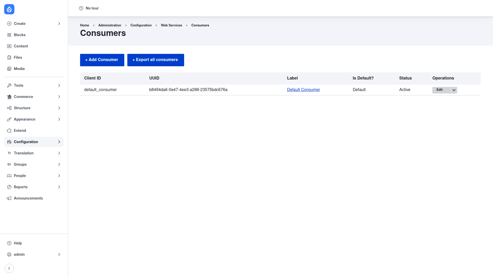

# Consumers — manual setup guide

**Consumers** (`consumers`) registers the client applications — the
"consumers" — that talk to your Drupal site's API. Each consumer represents a
front-end app, a mobile app, or a service, and carries its own identity: a
**client ID** (plus a **secret** when you use confidential clients), a set of
**roles** and **scopes** that requests from that client are allowed to use, an
optional logo, and flags such as whether it is the **default** consumer.

By modelling every client as a `consumer` content entity, the module gives your
site a single, shared registry of who is calling the API. This is what
underpins decoupled and OAuth setups: **Simple OAuth**, for example, uses the
Consumers registry to decide which client is requesting a token and what that
client is permitted to do. On its own Consumers ships almost no business logic —
it is the foundation that authentication and decoupled modules build on.

This guide is written for a **human** clicking through the admin UI. It walks
you, step by step and with screenshots, from installing the module to
registering your first consumer. If you are looking for terse, token-cheap
references for an AI coding agent, read the sibling [`agent/`](../agent/start.md)
docs instead.

## Where it lives in the admin menu

Everything in this guide sits under **Configuration → Web services →
Consumers** (`/admin/config/services/consumer`). That page lists every consumer
registered on the site and gives you an **+ Add Consumer** button to create a
new one.

## Contents

1. [Installation](installation/index.md) — install Consumers with Composer and
   enable it, typically alongside Simple OAuth.
2. [Configuration](configuration/index.md) — understand the Consumers list and
   what a consumer represents.
3. [Adding a consumer](adding-a-consumer/index.md) — register a client
   application and set its label, client ID/secret, roles, scopes, and redirect
   URIs.
