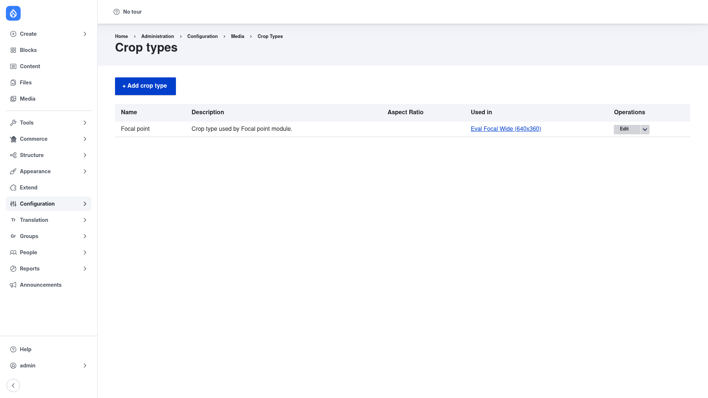

# Configuration — managing crop types

The one thing you configure by hand in Crop API is its **crop types**. A crop
type is a reusable, named preset — think "16:9 hero", "Square thumbnail" or
"Focal point" — that records the shape a crop should take (its aspect ratio) and
optional rules about how small a crop is allowed to be. You define a crop type
once and then reference it from as many image styles as you like, so every image
cropped to that preset comes out consistently.

Managing crop types requires the **administer crop types** permission.

## The Crop types list

1. Go to **Configuration → Media → Crop types**
   (`/admin/config/media/crop`).
2. You land on the **Crop types** page. It lists every crop type on the site in
   a table with **Name**, **Description**, **Aspect Ratio**, **Used in** (which
   image styles reference the type) and **Operations** (Edit / Delete) columns,
   plus an **+ Add crop type** button at the top.

## Add a crop type

1. On the Crop types page, click **+ Add crop type**.
2. Fill in the fields:
   - **Name** — a human-readable label for the preset (for example
     `16:9 hero`). Drupal derives a machine name from it automatically.
   - **Description** — optional notes on what the preset is for; this is the
     text shown in the **Description** column of the list.
   - **Aspect ratio** — the fixed shape of the crop, written as `width:height`
     (for example `16:9`, `4:3`, or `1:1` for a square). It must match the
     pattern *digits, a colon, digits*. Leave it **empty** to allow a free-form
     crop with no fixed ratio.
   - **Soft limit (width × height)** — a *recommended* minimum crop size in
     pixels. If an editor draws a crop smaller than this, the cropping UI shows
     a warning but still lets them save. Use it to nudge editors toward
     large-enough selections.
   - **Hard limit (width × height)** — an *enforced* minimum crop size in
     pixels. A crop smaller than the hard limit is not allowed. Use it to
     guarantee a minimum resolution for the derivative.
3. Click **Save**. The new crop type appears in the list, ready to be used by an
   image style.

To change or remove a preset later, use the **Edit** and **Delete** links in the
**Operations** column of the list.

## Putting a crop type to work

Creating a crop type on its own does nothing visible yet — a crop type is only a
definition. Two more pieces connect it to real images, and both live **outside**
the Crop module:

1. **Add a "Crop" effect to an image style.** Go to **Configuration → Media →
   Image styles** (`/admin/config/media/image-styles`), edit or add a style, and
   add the **Crop** (also called *Manual crop*) effect. When you add the effect
   you choose *which crop type* it applies. From then on, that image style
   generates its derivative using the crop stored for that crop type.
2. **Install a cropping UI module.** Because Crop ships no editor, an editor
   needs a consuming module — **Image Widget Crop** or **Focal Point** — to
   actually draw the crop box on an image and save it against your crop type.
   Once that module is configured to use your crop type, the crop an editor
   makes is stored and then re-applied by the image effect from step 1.

In short: **Crop type** (defined here) → referenced by a **Crop image effect**
in an image style → filled in by an editor through a **UI module**. Crop API
provides the first and the storage behind the third; you supply the image style
and the UI module yourself.
