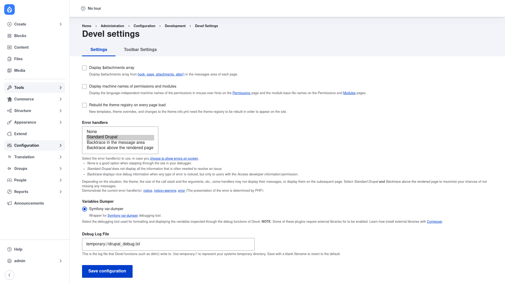

# Configuration — Devel settings

The **Devel settings** page controls how Devel behaves site-wide: which error
handler it installs, which backend formats your variable dumps, where debug
output is written, and a few display conveniences. The defaults are sensible for
most development, but it is worth understanding each option.

## Open the settings page

1. Go to **Configuration → Development → Devel settings**
   (`/admin/config/development/devel`).
2. You land on the **Settings** tab. A second **Toolbar Settings** tab lets you
   choose which Devel links appear in the toolbar (available when the core
   Toolbar or Navigation module is enabled).

## The options

### Display $attachments array

When ticked, Devel prints the `$attachments` array from
`hook_page_attachments_alter()` in the messages area of every page. Useful when
you are debugging which libraries, metatags, or head elements a page attaches.
Leave it off for normal work.

### Display machine names of permissions and modules

When ticked, the **Permissions** and **Modules** (Extend) pages show the
language-independent machine names — as mouse-over hints on permissions, and as
the base file name for each module. Handy when you need the exact machine name to
reference in code or config.

### Rebuild the theme registry on every page load

When ticked, Drupal rebuilds the theme registry on every request so that new
templates, theme overrides, and changes to `*.info.yml` appear immediately
without a manual cache clear. This slows every page load, so enable it only
while actively editing templates and turn it off afterwards.

### Error handlers

A multi-select list that chooses which PHP error handler(s) Devel installs.
Hold Ctrl/Cmd to select more than one:

- **None** — a good choice when you are stepping through the site in a debugger
  (xdebug) and do not want Devel intercepting errors.
- **Standard Drupal** — Drupal's normal error display. It does not always show
  all the detail needed to resolve an issue.
- **Backtrace in the message area** — shows a rich backtrace in the messages
  region when an error is noticed (only for users with the *access developer
  information* permission).
- **Backtrace above the rendered page** — shows the same rich backtrace at the
  top of the page.

Depending on the theme, call-stack size, and arguments, some handlers may not
display their messages. Selecting **Standard Drupal** *and* **Backtrace above
the rendered page** together maximises your chances of seeing every message.

### Variables Dumper

A radio list choosing which backend formats and displays the variables you
inspect with Devel's debug functions (`dpm()`, `dvm()`, `kint()`, etc.):

- **Symfony var-dumper** — the default, provided by the required
  `symfony/var-dumper` library.
- **Kint** — appears as an option once the `kint-php/kint` library is installed
  (see [Installation](../installation/index.md)). Kint produces a more
  interactive, expandable dump.

Some dumper plugins require external libraries; if an option is missing, install
its library with Composer first.

### Debug Log File

The file that Devel functions such as `dd()` write to when you log output
instead of printing it to the page. The default is `temporary://drupal_debug.txt`
— the `temporary://` scheme maps to your system's temporary directory. Save the
field **blank** to revert to the default.

## Save

Click **Save configuration** at the bottom. Your changes take effect
immediately.

## Related tools

Beyond this form, Devel adds a few things you drive elsewhere in the UI:

- **Devel menu / toolbar** — quick developer actions (clear cache, rebuild
  router, reinstall modules, open the config editor). Use the **Toolbar
  Settings** tab to pick which links show.
- **Switch user block** — place the *Switch user* block (Structure → Block
  layout) to become any account with one click and test its permissions. This
  requires the `switch users` permission.

Both the debug output and the introspection pages are gated by the **access
devel information** permission, and admin actions (settings, reinstall, config
editor) additionally require **administer site configuration** — grant these
only to trusted developers.
