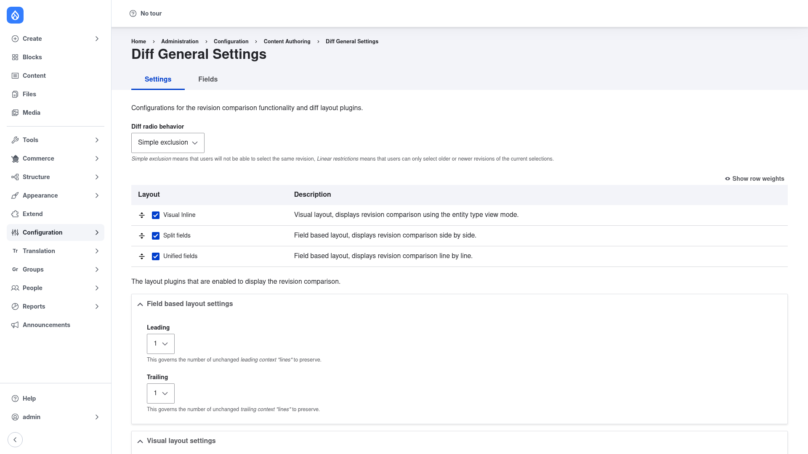

# Installation

## Requirements

Diff needs **Drupal 10.5+ or 11** and **PHP 8.1 or newer**. It also depends on
one external PHP library, **`mkalkbrenner/php-htmldiff-advanced`** (`~0.0.8`),
which does the heavy lifting for the rendered "visual" comparison. Composer pulls
that library in automatically, so there is nothing to download by hand.

Diff has no other contrib module dependencies.

## Install with Composer

From the project root:

```bash
composer require drupal/diff -W
```

The `-W` (`--with-all-dependencies`) flag lets Composer install the
`php-htmldiff-advanced` library and update any related dependencies as needed.

> **Using DDEV?** Prefix Composer and Drush with `ddev` when you run from your host
> machine — `ddev composer require drupal/diff -W`, `ddev drush …`. Inside the
> container (`ddev ssh`) run them without the prefix.

## Enable the module

```bash
drush en diff -y
```

Once enabled, the module's settings appear under **Configuration → Content
authoring → Diff** (`/admin/config/content/diff`).

## Verify it worked

Log in as an administrator and go to `/admin/config/content/diff/general`. You
should see the **Diff General Settings** page with its **Settings** and **Fields**
tabs:



If the page loads and shows the layout table (Visual Inline, Split fields,
Unified fields), the module is installed correctly. Next, review the
[configuration](../configuration/index.md) to choose your default comparison
layout.
