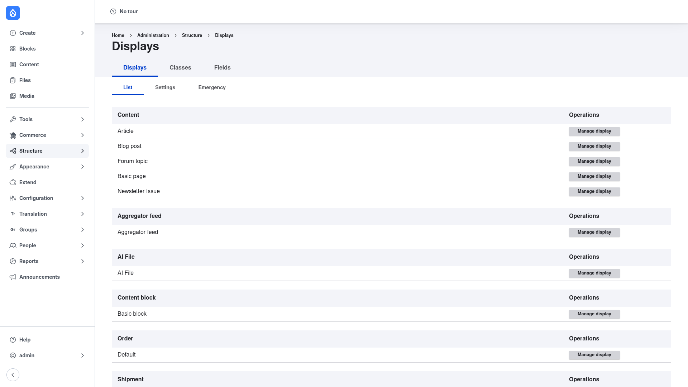

# Configuration

Display Suite has two halves. The **control panel** at
`/admin/structure/ds` is where you set global options and define reusable pieces
(custom fields and CSS classes). The actual work of applying a layout and
arranging fields happens on each entity's own **Manage display** screen. This
page tours the control panel first, then walks through the core workflow.

## The Display Suite control panel

Go to **Structure → Display Suite** (`/admin/structure/ds`). The page opens on
the **Displays** tab and lists every entity type and bundle on your site, each
with a **Manage display** button that jumps straight to that bundle's display
settings.

Across the top are the primary tabs, and the Displays tab has its own row of
secondary tabs:

- **Displays → List** — the entity list shown above. This is your jumping-off
  point: find the content type you want to restyle and click **Manage display**.
- **Displays → Settings** — global Display Suite options that apply site-wide.
- **Displays → Emergency** — a safety valve. If a layout ever breaks a page so
  badly you cannot reach the display settings to fix it, this tab lets you
  disable Display Suite layouts to recover.
- **Classes** — define reusable **CSS classes** here once, and they become
  available to attach to layout regions on any display.
- **Fields** — define reusable **custom (virtual) fields** here — token, Twig,
  block, and copy fields — and they become available to place on any display,
  just like real entity fields.

## The core workflow: apply a layout and arrange fields

This is the heart of Display Suite. You do it on the **Manage display** screen of
whichever entity type and view mode you want to restyle.

1. **Open a display.** On the Displays tab (above), click **Manage display** next
   to the content type you want — for example **Article**. This is the same
   *Manage display* screen Drupal core provides; Display Suite adds extra options
   to it.

2. **Pick the view mode.** A display is per view mode (Default, Teaser, Full
   content, and any custom view modes). Use the **Custom display settings** at the
   bottom of the screen to enable the view mode you want, then switch to its tab.
   The **Default** view mode is a good place to start.

3. **Choose a Display Suite layout.** Open the **Layout for … in default** section
   (a vertical tab on the Manage display screen) and select a layout from the
   list. Display Suite ships a range of them:

   - **One column** — a single region; the simplest layout.
   - **Two column** and **Two column stacked** — side-by-side regions, optionally
     with full-width header and footer regions above and below.
   - **Three column** (equal-width and stacked variants) and **Four column** — for
     denser, grid-like displays.
   - **Reset** — strips wrapping markup back to bare output.

   Any custom Layout API layout your theme or another module provides also shows
   up in this list. When you pick a layout, the field table below reorganises to
   show that layout's **regions** — the named areas (such as *Header*, *Left*,
   *Right*, *Footer*) that fields can live in.

4. **Drag fields into regions.** Each field on the display now has a **Region**
   dropdown (or drag handle). Assign every field to one of the layout's regions —
   for instance, put the image in *Left*, and the title and body in *Right*. Any
   field left in the *Disabled* / *Hidden* area is not rendered. This is how you
   reposition content without touching a template.

5. **Tune each field's markup (optional).** Display Suite adds a **field template**
   option per field, letting you control the wrapping HTML, where the label sits
   (above, inline, or hidden), and any CSS classes on the field. Use the *Reset*
   field template to output a field with no wrapper at all.

6. **Save.** Click **Save** at the bottom. View a piece of that content type and
   the entity now renders through your layout, with fields in the regions you
   chose.

## Add custom (virtual) fields

Beyond the entity's real fields, Display Suite lets you place **custom fields** on
a display — computed values that are not stored fields. Define them once on the
control panel's **Fields** tab, then they appear in the field table on Manage
display like any other field, ready to drag into a region. The available types
are:

- **Token field** — arbitrary markup built from tokens, e.g. `[node:author]`.
- **Twig field** — an inline Twig template with access to the entity's variables.
- **Block field** — renders a block plugin (a menu, a view, and so on) inline in
  the display.
- **Copy field** — duplicates another field's output into a second region.

## Add reusable CSS classes to regions

To style layout regions, define class names once on the control panel's
**Classes** tab. Those classes then become selectable on the **Layout for …**
section of any Manage display screen, so you can attach them to individual
regions and target them from your theme's CSS.

## Where it's all stored

Everything you configure — the chosen layout, region assignments, field
templates, custom fields, and classes — is saved as configuration on the entity
view display. That means you can export it with `drush config:export` and deploy
your displays between environments like any other Drupal configuration.
