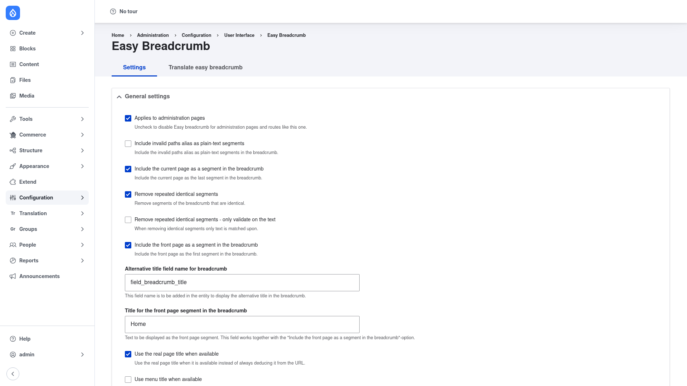

# Configuration — the settings form

Easy Breadcrumb works out of the box, but every part of the trail is adjustable from
one form. This page walks through the settings you are most likely to change: the
**Home** segment, the **current-page** segment, how titles are sourced, how segment
text is **capitalized**, the **separator** between crumbs, and which **paths** are
hidden. All of these settings live in the `easy_breadcrumb.settings` config object, so
they are exportable and can be deployed between environments.

## Open the settings form

1. Go to **Configuration → User interface → Easy Breadcrumb**
   (`/admin/config/user-interface/easy-breadcrumb`).
2. Make sure you are on the **Settings** tab. Everything below sits under the
   **General settings** section.

When you are done, click **Save configuration** at the bottom of the form to apply
your changes.

## The Home segment

- **Include the front page as a segment in the breadcrumb** — when ticked, every
  trail starts with a crumb that links back to the site's front page. This is the
  "Home" crumb. Turn it off if you don't want a leading Home link.
- **Title for the front page segment in the breadcrumb** — the label shown for that
  Home crumb. It defaults to **Home**; change it to anything you like (for example
  `Start`). This field only matters when the front-page segment above is enabled.

## The current-page (title) segment

- **Include the current page as a segment in the breadcrumb** — when ticked, the
  **current page's title is appended as the last crumb**, so the trail ends on the
  page the visitor is actually viewing. This is what turns core's shorter breadcrumb
  into a complete `Home › Section › Page` trail. Untick it if you prefer the trail to
  stop before the current page.

## Real page title vs. the raw path

- **Use the real page title when available** — when ticked, Easy Breadcrumb uses the
  page's **actual title** for a segment instead of guessing a title from the URL. For
  example, on a node whose title is "Our Leadership Team" but whose alias segment is
  `team`, ticking this shows *Our Leadership Team* rather than *Team*. When the real
  title can't be determined, it falls back to deducing a title from the URL segment.
- **Alternative title field name for breadcrumb** — the machine name of a field
  (default `field_breadcrumb_title`) that Easy Breadcrumb will read a crumb title from
  if that field exists on the entity. Add this field to a content type when you want a
  breadcrumb label that differs from the page title. Leave the default if you are not
  using an alternative field.

## Capitalization and text transformation

Easy Breadcrumb can tidy up how each segment's text is cased. The **capitalization
mode** offers four choices:

- **none** — leave segment text exactly as it comes from the title or path.
- **First letter of first word** (`ucfirst`) — capitalize only the first letter of
  the segment.
- **First letter of each word** (`ucwords`) — Title-Case each word. This is the
  default and gives the most polished look.
- **All letters** (`ucall`) — render the whole segment in upper case.

Two refinements go with the "each word" mode: a list of small **ignored words** (such
as `of`, `and`, `de`) that are kept lowercase, and a list of **forced words** you can
pin to a fixed casing (useful for brand names like `iOS` or `GmbH`).

## The segment separator

Easy Breadcrumb lets you set the **separator** drawn between crumbs — the character
(or characters) shown between one segment and the next, such as `›`, `»`, or `/`.
Set it to whatever matches your theme's style.

## Hidden path segments

- **Excluded paths** — a list of paths (one per line) that should be **omitted** from
  the breadcrumb entirely. The module ships excluding `search` and `search/node` so
  those utility routes don't clutter the trail. Add any paths you'd rather not show as
  crumbs.
- **Applies to administration pages** — controls whether Easy Breadcrumb also builds
  breadcrumbs on admin pages (like the settings form itself). It is on by default;
  untick it to leave admin-page breadcrumbs to Drupal core.
- **Include invalid paths alias as plain-text segments** — when a path segment does
  not resolve to a real, linkable route, ticking this keeps it in the trail as plain
  (non-linked) text instead of dropping it. Off by default.

## Removing duplicate segments

- **Remove repeated identical segments** — drops a crumb when it would be identical to
  the one before it, so the trail doesn't repeat itself. On by default.
- **Remove repeated identical segments - only validate on the text** — when de-duping,
  compare crumbs by their **visible text only** (ignoring the underlying URL). Off by
  default.

## Save

Click **Save configuration**. Your changes take effect immediately — reload any page
on the front end to see the updated trail.
