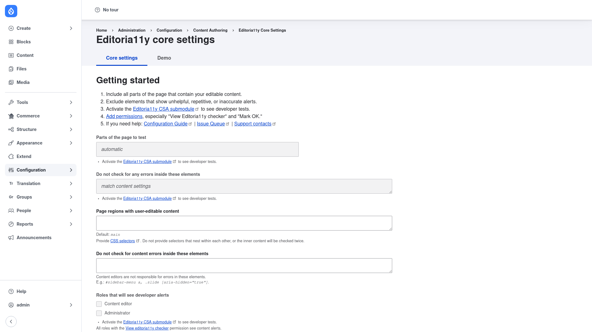

# Editoria11y — manual setup guide

**Editoria11y** ("editorial accessibility") is an automatic accessibility
checker built for **content authors**. Instead of waiting for a separate audit,
it works quietly in the background: as authorized users browse the live site, it
scans each rendered page and flags the accessibility problems that editors can
actually fix themselves — missing image alt text, suspicious alt text, skipped
or out-of-order headings, meaningless link text like "click here", tables
without headers, video that may need captions, and more. Each issue gets an
unobtrusive inline marker with a tooltip pinned to the offending element, plus a
small toggle panel that lists everything found on the current page.

Findings are also rolled up into a **site-wide results dashboard** so an
accessibility lead can triage issues across the whole site, grouped by page and
by issue type.

This guide is written for a **human** clicking through the admin UI. It walks you
step by step, with screenshots, from installing the module to configuring which
parts of your pages get checked. If you are looking for terse, token-cheap
references for an AI coding agent, read the sibling [`agent/`](../agent/start.md)
docs instead.

## Where it lives in the admin menu

The configuration screen sits under **Configuration → Content authoring →
Editoria11y** (`/admin/config/content/editoria11y`). It has two tabs:

- **Core settings** (`/admin/config/content/editoria11y`) — where you tell the
  checker which parts of your pages to scan, which regions to ignore, and which
  roles see the alerts.
- **Demo** (`/admin/config/content/editoria11y/demo`) — a built-in sample page of
  deliberately broken content, handy for showing new editors what the checker
  looks like in action.

The results dashboard lives separately under **Reports → Content Accessibility
Issues** (`/admin/reports/editoria11y`).

## Contents

1. [Installation](installation/index.md) — install Editoria11y with Composer,
   enable it, and grant the permission that lets editors see the checker.
2. [Configuration](configuration/index.md) — set which content regions are
   scanned, which alerts are shown, and review results on the dashboard.
