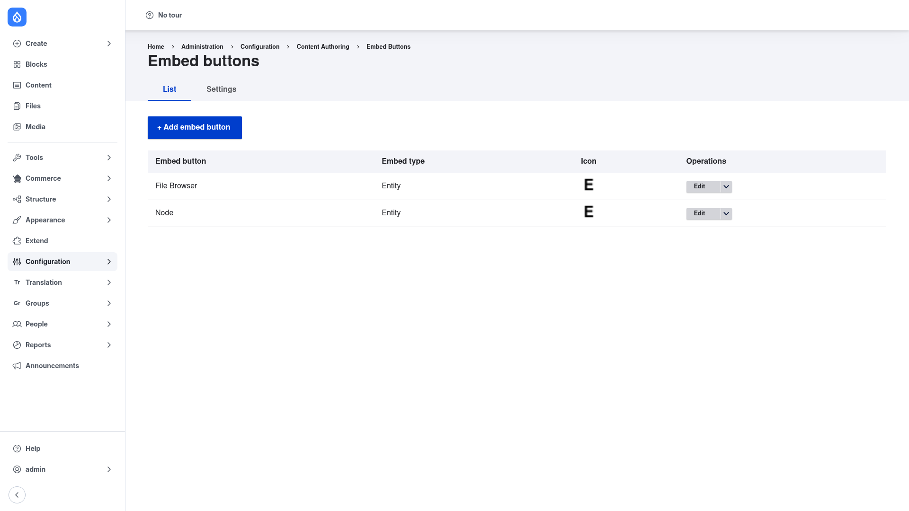

# Installation

## Requirements

Embed needs **Drupal 10.2+ or 11** (`^10.2 || ^11`). It has no contrib module
dependencies of its own — it is a self-contained framework in the **Filters**
package.

Because Embed provides no user-facing embeds by itself, you will almost always
install it together with a **consumer module** that supplies actual embed types
and buttons. The most common is **Entity Embed** (`entity_embed`), which lets
authors embed any entity; core's **Media** and **Media Library** modules also
build on Embed to embed media in rich text. Installing such a consumer pulls Embed
in automatically as a dependency.

## Install with Composer

From the project root:

```bash
composer require drupal/embed -W
```

The `-W` (`--with-all-dependencies`) flag lets Composer update any related
packages as needed. To install a consumer at the same time, add it to the same
command, for example `composer require drupal/embed drupal/entity_embed -W`.

> **Using DDEV?** Prefix Composer and Drush with `ddev` when you run from your host
> machine — `ddev composer require drupal/embed -W`, `ddev drush …`. Inside the
> container (`ddev ssh`) run them without the prefix.

## Enable the module

```bash
drush en embed -y
```

To enable a consumer at the same time, list it too — for example
`drush en embed entity_embed -y`.

## Verify it worked

Log in as an administrator and go to `/admin/config/content/embed`. You should see
the **Embed buttons** screen with a **List** tab and an **+ Add embed button**
button:



If the page loads and shows the **List** and **Settings** tabs, the module is
installed correctly. Next, review the
[configuration](../configuration/index.md) to add an embed button and enable it in
a text format's toolbar.
