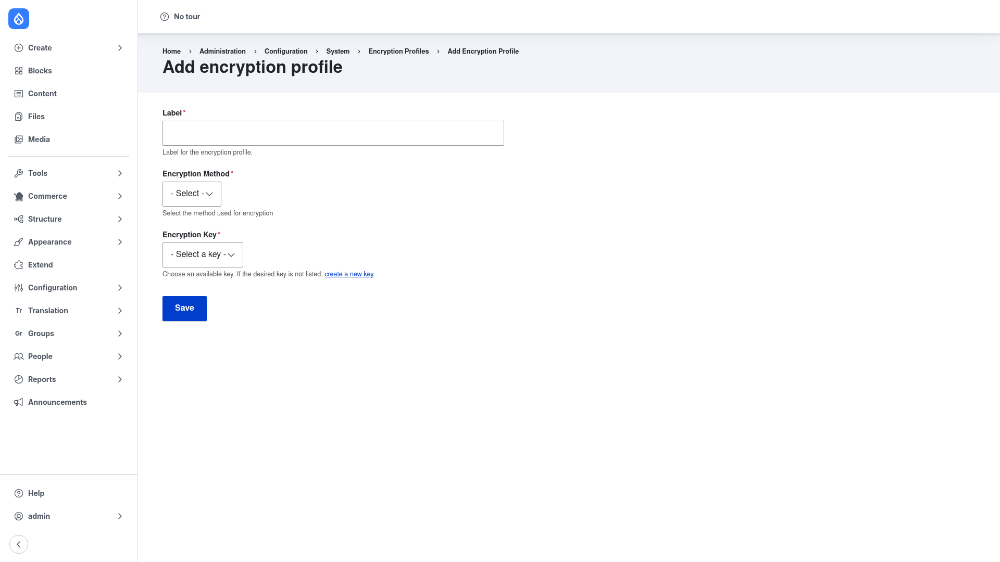

# Creating an encryption profile

An **encryption profile** ties an encryption method to a key so that other modules have
a single, named configuration to encrypt and decrypt with. Creating one is a two-part
job: first make sure the **key** exists (in the Key module), then create the profile
that points at it.

## Step 1 — Create a key first

A profile cannot be saved without a key to reference, so start there.

1. Install and enable the [Key](../../../../key/1.22.x/human-docs/index.md) module if it
   is not already (Encrypt pulls it in as a dependency).
2. Go to **Configuration → System → Keys** (`/admin/config/system/keys`) and add a key
   that holds your secret. Choose a key **type** and **size** appropriate for the
   encryption method you plan to use — for example, an AES method typically wants a
   256-bit encryption key.
3. Store the secret using a key **provider** that keeps it out of code and config — an
   environment variable, a file outside the web root, or a KMS. The Key module's own
   [Adding a key](../../../../key/1.22.x/human-docs/adding-a-key/index.md) guide walks
   through this in detail.

Keeping the secret in the Key module — never pasted into the profile — is the core
security practice of the whole setup.

## Step 2 — Add the encryption profile

1. Go to **Configuration → System → Encryption profiles**
   (`/admin/config/system/encryption/profiles`).
2. Click **+ Add Encryption Profile** (`/admin/config/system/encryption/profiles/add`).

The add form has three fields:

1. **Label** — a human-readable name for the profile (for example "Field data
   encryption"), so you can recognise it in the list and other modules can identify it.

2. **Encryption Method** — the cipher this profile uses. Pick from the methods
   installed on your site. For strong AES encryption, install and enable **Real AES**
   first (see [Installation](../installation/index.md)) so its AES method appears in the
   **- Select -** dropdown. The method determines *how* data is encrypted.

3. **Encryption Key** — the key created in Step 1. Choose it from the **- Select a
   key -** dropdown. This is the secret the method will use. If the key you want is not
   listed, the form offers a **create a new key** link that takes you to the Key module
   to add one, after which you can return and select it. Some encryption methods
   restrict which key *types* are selectable, so only compatible keys appear.

Click **Save**. The new profile now appears in the Encryption profiles list.

## Step 3 — (Optional) Test the profile

From the profiles list, use the profile's operations to open its **test** page. This
round-trips a sample string through the profile — encrypting then decrypting it — to
confirm the method and key are configured correctly before any real data depends on it.

## What happens next

Once the profile is saved, other modules can reference it by name. For example,
Encrypted Field can encrypt selected field values, and Webform encrypt can protect
submission data — each pointing at the profile you just created rather than being
configured with a cipher and key of their own. Because the profile is a configuration
entity, you can also export it with the rest of your site configuration and deploy it
between environments; only the profile reference travels, never the key material, which
stays safe in the Key module.
