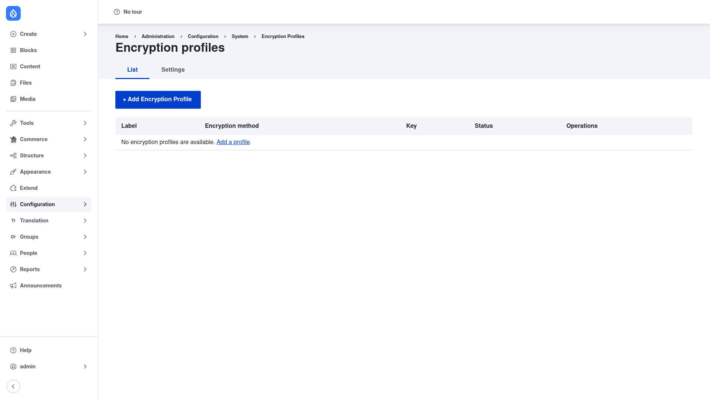

# Installation

## Requirements

Encrypt runs on **Drupal 8, 9, 10, or 11** and depends on one contrib module, which
Composer pulls in automatically:

- **Key** (`key`, `^1`) — manages the secret material (keys) that your encryption
  profiles reference. Encrypt stores *which* key a profile uses, but the key itself is
  owned and protected by the Key module. See the Key module's own
  [manual setup guide](../../../../key/1.22.x/human-docs/index.md) for how to add a key.

Encrypt on its own does not ship a strong cipher. To do real AES encryption you also
need a **companion encryption method module** that provides one — most commonly
**Real AES** (`real_aes`), which adds an AES encryption method backed by the
`defuse/php-encryption` library. Without such an add-on, the only methods available
are the basic ones bundled with core/Encrypt, so install the method that matches your
security needs before creating a profile.

## Install with Composer

From the project root:

```bash
composer require drupal/encrypt -W
```

The `-W` (`--with-all-dependencies`) flag lets Composer pull in and update the `key`
dependency as needed. If you want AES, require the method module at the same time, for
example `composer require drupal/real_aes -W`.

> **Using DDEV?** Prefix Composer and Drush with `ddev` when you run them from your
> host machine — `ddev composer require drupal/encrypt -W`, `ddev drush …`. Inside the
> container (`ddev ssh`) run them without the prefix.

## Enable the module

```bash
drush en encrypt -y
```

This also enables the `key` module as a dependency. If you installed a method module
such as Real AES, enable it too (`drush en real_aes -y`) so its encryption method
becomes selectable on the profile form.

## Verify it worked

Log in as an administrator and go to
`/admin/config/system/encryption/profiles`. You should see the **Encryption profiles**
page with a **+ Add Encryption Profile** button:



On a fresh install the list is empty ("No encryption profiles are available"). If the
page loads and the **List** and **Settings** tabs are present, the module is installed
correctly. Next, review the [configuration](../configuration/index.md) and then
[create your first profile](../creating-a-profile/index.md).
