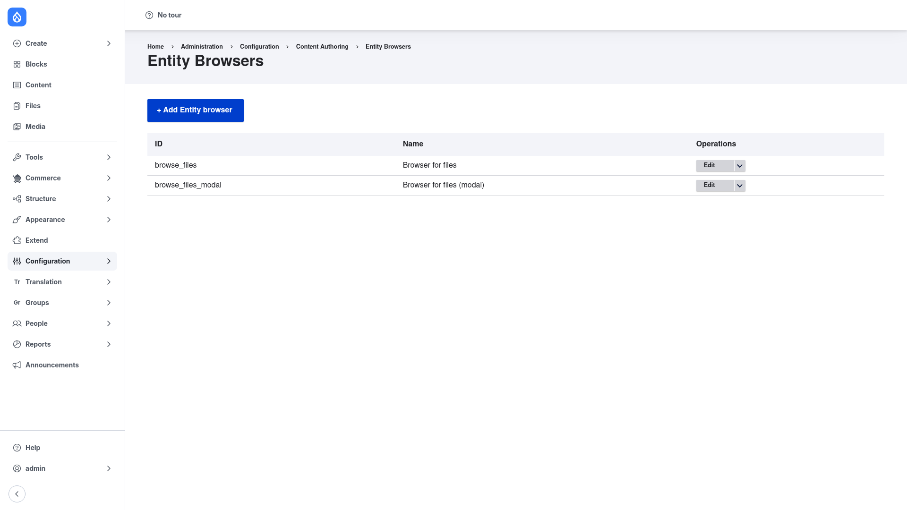

# Configuration — the browsers list and plugin layers

Entity Browser doesn't have a single global settings page. Instead, all of its
configuration is a collection of reusable **browsers**, each one built from a
handful of pluggable parts. This page explains where the browsers live and the
four layers every browser is assembled from, so the
[add wizard](../creating-a-browser/index.md) makes sense before you start
clicking.

## The Entity Browsers list

Go to **Configuration → Content authoring → Entity browsers**
(`/admin/config/content/entity_browser`). This page lists every browser
configured on the site, showing each browser's **ID** (machine name) and
**Name** (label), with an **Edit** operation for each and an **+ Add Entity
browser** button to create a new one.

Each browser is a configuration entity (`entity_browser.browser.*`), so it is
fully exportable — you can build a browser here and deploy it between
environments as configuration.

## The four plugin layers

Every browser is assembled from four pluggable parts. You choose one option for
each when you [create the browser](../creating-a-browser/index.md):

- **Display** — how the browser opens for the editor. The options are **Modal**
  (a pop-up window over the page), **iFrame** (embedded inline in the page),
  and **Standalone form** (its own page/route; intended mainly for testing or
  very specific use cases).
- **Widgets** — the selection sources inside the browser, ordered by weight.
  Core widgets include **View** (a Views-powered listing of entities), **Upload**
  (a file upload), and **media_image_upload**. The **Entity form** widget (for
  creating entities inline) is added by the Inline Entity Form submodule. A
  browser can have several widgets at once.
- **Widget selector** — how the editor switches between multiple widgets:
  **Tabs**, a **Drop-down**, or **Single** (when there is only one widget and no
  switching is needed).
- **Selection display** — how the items an editor has picked are shown before
  they submit. Options are **Multi-step selection display** (a running list you
  can reorder), a **View**-based display, or **No selection display**.

Two more plugin types come into play when you wire a browser to a field rather
than when you build the browser itself: **field widget display** (how selected
items render in the field — as a label, a rendered entity, or a thumbnail) and
**widget validation** (rules such as cardinality, entity type, and file
constraints enforced when the editor submits). Those are configured on the
field's form display — see
[Creating a browser](../creating-a-browser/index.md).
