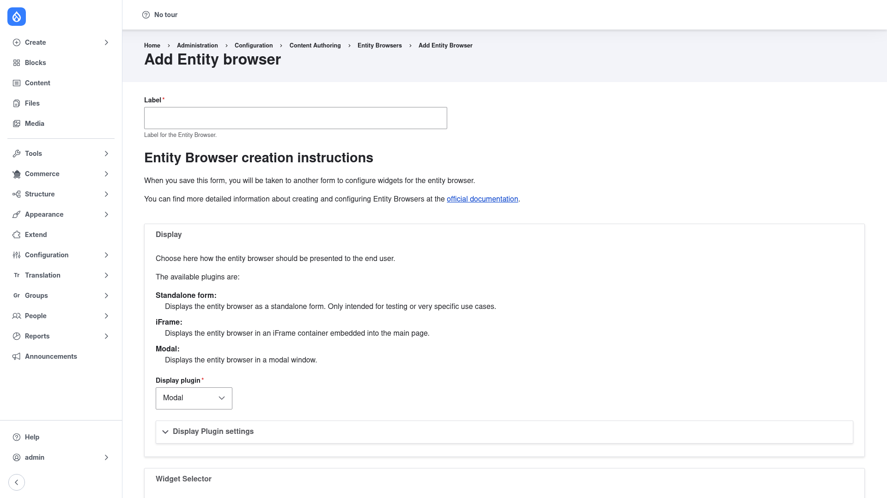

# Creating a browser

A **browser** is the reusable picker an editor opens from a field. You build it
once — choosing how it opens, what selection sources it offers, and how picks
are shown — and then attach it to as many reference fields as you like. This
page walks through the add wizard and then explains how to wire the finished
browser to a field.

## Open the add form

1. Go to **Configuration → Content authoring → Entity browsers**
   (`/admin/config/content/entity_browser`).
2. Click **+ Add Entity browser**
   (`/admin/config/content/entity_browser/add`).

## Fill in the add wizard

The add form starts with a label and then presents the browser's plugin layers.
When you save it, you are taken to a second form to finish configuring the
widgets.

1. **Label** — a human-readable name for the browser (for example
   *Browser for files*). Drupal derives the machine name (the **ID** you saw in
   the list) from this.

2. **Display plugin** — choose how the browser opens for the editor. The form
   describes each option:
   - **Modal** — opens in a modal pop-up window over the page (a common choice).
   - **iFrame** — displays the browser in an iFrame embedded into the main page.
   - **Standalone form** — displays the browser as its own standalone form;
     the form notes this is only intended for testing or very specific use
     cases.

   Expand **Display Plugin settings** to set options for the chosen display
   (for a modal, for example, its width, height, and the button link text).

3. **Widget Selector** — choose how the editor switches between widgets:
   **Tabs**, a **Drop-down**, or **Single** if the browser has just one widget.

4. **Widgets** — add one or more selection sources. Typical choices are a
   **View** (a Views listing editors browse and select from, such as a grid of
   media) and **Upload** (a file upload). If you enabled the Inline Entity Form
   submodule, an **Entity form** widget is also available so editors can create
   a new entity inline. You can add several widgets and order them by weight.

5. **Selection display** — choose how picked items appear before submitting:
   the **Multi-step selection display** (a running list you can reorder), a
   **View**-based display, or **No selection display**.

6. Click **Save** to store the browser. Because the form is a wizard, saving the
   first page takes you on to configure the widgets in more detail; work through
   those settings and save again to finish.

Your new browser now appears in the
[Entity Browsers list](../configuration/index.md).

## Attach the browser to a reference field

Building a browser doesn't change any field on its own — you have to point a
field at it. Entity Browser ships two field widgets for this, which you select
from the **Manage form display** tab of the entity type that owns the field:

- **Entity browser** (`entity_reference_browser`) — for entity reference fields.
- **File browser** (`entity_browser_file`) — for file and image fields.

On **Manage form display**, find your reference field, change its widget to
**Entity browser** (or **File browser**), then open the widget's settings (the
gear/cog) to configure it. The key options are:

- **Entity browser** — which browser (the one you just created) this field
  should open.
- **Field widget display** — how already-selected items render in the field:
  as a **label**, a **rendered entity**, or a **thumbnail** (with its own
  settings, such as an image style).
- **Edit** / **Remove** buttons — whether to show per-item edit and remove
  controls.
- **Open** — whether the browser opens immediately.
- **Selection mode** — whether new picks append to, or replace, the current
  selection.

The field's cardinality is passed through to the browser and enforced
automatically, so editors can't select more items than the field allows. Save
the form display, and the field will now open your browser whenever someone
edits that content.
