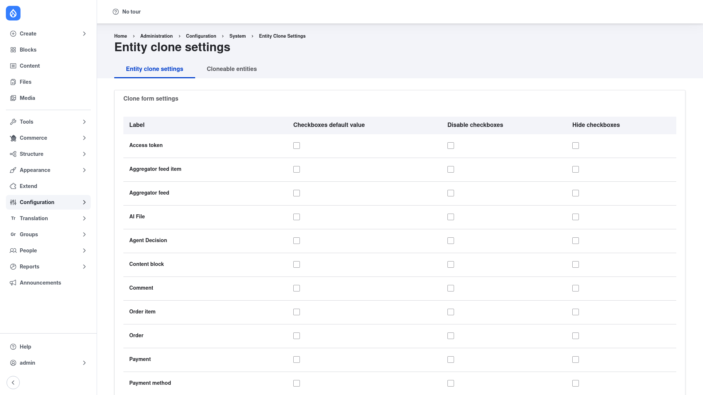

# Configuration — clone settings and running a clone

Entity Clone gives you one page to control *how* cloning behaves for each entity
type, and a second tab to control *which* entity types can be cloned at all.
Both require the **Administer entity clone** permission. Once the behaviour is
set and editors hold the right [clone permissions](../installation/index.md),
they duplicate entities from the **Clone** action on the entity itself.

## Open the settings page

1. Go to **Configuration → System → Entity Clone settings**
   (`/admin/config/system/entity-clone`).
2. You land on the **Entity clone settings** tab. A second tab, **Cloneable
   entities**, sits next to it.

## Per entity type: the Clone form settings table

Under the **Clone form settings** heading is a table with one row per entity
type (Access token, Aggregator feed item, Content block, Comment, Order, Payment
and so on — every content and configuration entity type on your site). Each row
has three checkbox columns that control how that type's reference fields behave
on the clone form:

1. **Checkboxes default value** — when ticked, the reference fields on this
   entity type are set to *clone by default*. On the clone form, the option to
   also duplicate the entities this one references starts already selected, so a
   deep clone happens unless the editor unticks it.
2. **Disable checkboxes** — when ticked, cloning is turned off for this entity
   type: the reference-field clone options are locked so an editor cannot change
   whether referenced entities are copied.
3. **Hide checkboxes** — when ticked, this type's reference-field options are
   hidden from the clone form entirely, so editors never see them.

Set these per type according to how you want each one to duplicate — for
example, tick **Checkboxes default value** on a landing-page type so its
paragraphs come along automatically, or tick **Hide checkboxes** on a type whose
references should never be touched.

There are also global options that apply to every clone, such as whether to
append a "(cloned)" suffix to the new label and whether the person doing the
cloning becomes the owner of the new entity. Adjust the options you need, then
click **Save configuration** at the bottom of the page.

## Choosing which entity types are cloneable

Click the **Cloneable entities** tab
(`/admin/config/system/entity-clone/cloneable-entities`). This page lists the
entity types on your site and lets you mark which ones are allowed to be cloned.
Only the types you enable here expose the **Clone** action, so you can declutter
the interface by turning off types your editors never need to duplicate. Tick
the types you want to allow and **Save**.

## Cloning an entity as an editor

With behaviour configured and the matching **Clone _{entity type}_ entity**
permission granted, editors run the clone action directly on the entity — there
is nothing to visit in the admin menu:

1. Find the entity to duplicate — for example a node in the **Content** list
   (`/admin/content`), a term on a taxonomy overview, or a menu under
   **Structure**.
2. Open the operations for that row (or the entity's local tasks) and choose
   **Clone**. The action appears wherever the entity's operations are shown, for
   users who hold that type's clone permission.
3. On the clone form, review the options for any reference fields — depending on
   the settings above, you may be able to choose whether the referenced entities
   are copied too. Confirm the clone.
4. Entity Clone creates a duplicate as a new entity (with a "(cloned)" suffix on
   the label unless you disabled that). Open the copy, adjust whatever needs to
   differ, and save it as your new item.

Because the action is attached to the entity type rather than to a single admin
screen, the same flow works for nodes, taxonomy terms, media, users, menus,
fields and the other types you marked cloneable.
