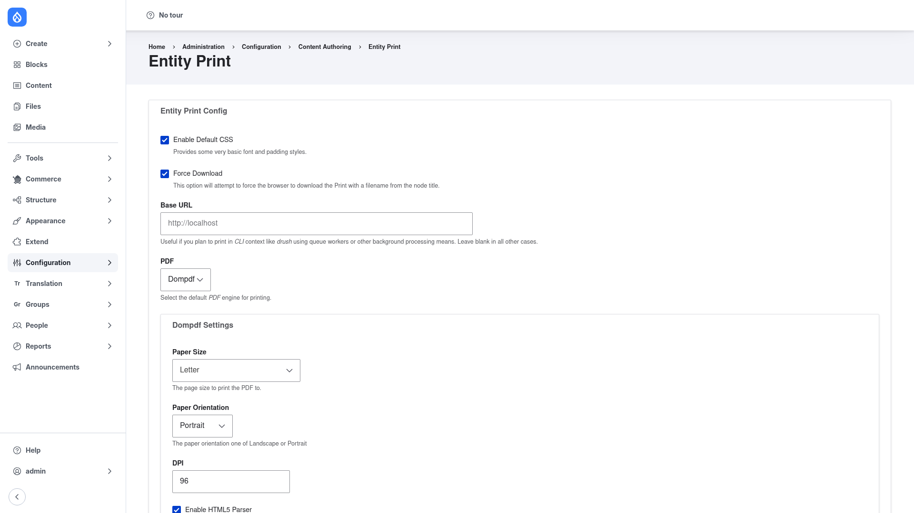

# Entity Print — manual setup guide

**Entity Print** (`entity_print`) generates **PDF** — and other print-friendly —
versions of *any* Drupal entity: nodes, Commerce orders, users, taxonomy terms,
custom entities, and more. It renders the entity through a normal Drupal render
pipeline into an HTML document and then hands that HTML to a pluggable **print
engine** (Dompdf by default) to produce the finished file.

For your visitors, Entity Print exposes a **"View PDF" / print link** on the
entities you choose, backed by a URL like `/print/pdf/node/42`. For developers it
also offers a programmatic API for rendering, streaming, and saving documents. In
addition to PDF, the export-type system can produce EPub and Word `.docx` output,
and a submodule (`entity_print_views`) can print entire Views.

This guide is written for a **human** clicking through the admin UI. It walks you,
step by step and with screenshots, from installing the module and its PDF library
to choosing a print engine and exposing a print link on your content. If you are
looking for terse, token-cheap references for an AI coding agent, read the sibling
[`agent/`](../agent/start.md) docs instead.

## Where it lives in the admin menu

Entity Print's configuration lives under **Configuration → Content authoring →
Entity Print** (`/admin/config/content/entityprint`). That single settings page
controls the default CSS, forced download, base URL, which **PDF engine** is used,
and each engine's own options (paper size, orientation, DPI, and more).

The links that let visitors *download* a PDF are configured elsewhere — on each
entity type's **Manage display** screen, as a **Print Links** block, or as a bulk
action — and are covered in [Configuration](configuration/index.md).

## Contents

1. [Installation](installation/index.md) — install Entity Print and a PDF library
   with Composer, then enable the module.
2. [Configuration](configuration/index.md) — choose a print engine, set paper size
   and CSS options, and expose the PDF/print link on your entities.
