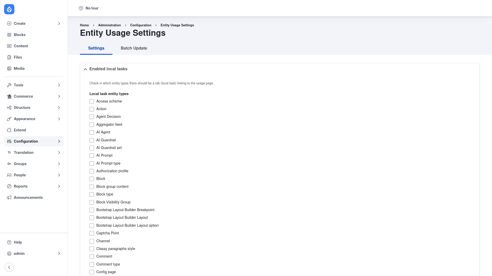

# Entity Usage — manual setup guide

**Entity Usage** (`entity_usage`) tracks where entities are referenced across
your site — which nodes embed a given media item, which pages link to a
particular file, which content still points at a taxonomy term. As editors
create, update, and delete content, the module records every relationship
between a *source* entity (the thing doing the referencing) and a *target*
entity (the thing being referenced). It then exposes that "where is this used?"
information through a per-entity **Usage** tab, usage reports, Views, and a
programmatic API, so you can see what depends on a piece of content *before* you
edit or delete it.

This guide is written for a **human** clicking through the admin UI. It walks
you, step by step and with screenshots, from installing the module to choosing
which entity types are tracked and where the **Usage** tab appears. If you are
looking for terse, token-cheap references for an AI coding agent, read the
sibling [`agent/`](../agent/start.md) docs instead.

## Where it lives in the admin menu

Entity Usage's configuration sits under **Configuration → Content authoring →
Entity Usage Settings** (`/admin/config/entity-usage/settings`). That page has
two tabs:

- **Settings** (`/admin/config/entity-usage/settings`) — choose which entity
  types are tracked as sources and targets, which tracking methods are active,
  and which entity types show a **Usage** tab.
- **Batch Update** (`/admin/config/entity-usage/batch-update`) — erase and
  regenerate the whole usage table after you change what is tracked or import
  content.

Once configured, the tracked usage data appears in two places for editors: the
per-entity **Usage** local-task tab on an entity's canonical page, and the usage
report under **Content**.

## Contents

1. [Installation](installation/index.md) — install Entity Usage with Composer,
   enable it, and back-fill usage data for content you already have.
2. [Configuration](configuration/index.md) — choose the source and target entity
   types to track, the tracking methods, and where the **Usage** tab appears.
