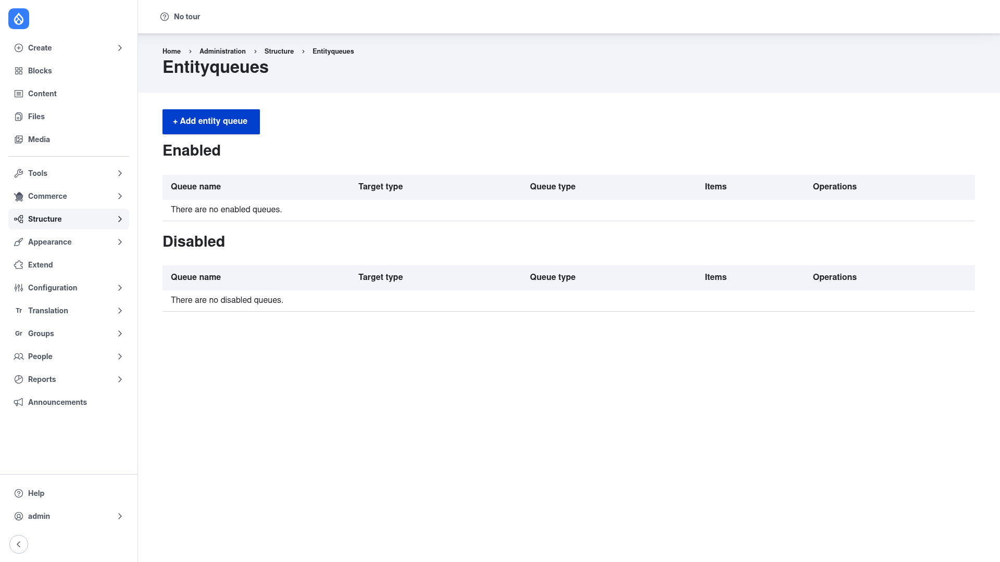

# Entityqueue — manual setup guide

**Entityqueue** (`entityqueue`) lets editors build ordered lists of entities — a
"Featured articles" block, a homepage carousel order, a hand-picked "Staff picks"
row — by adding items to a **queue** and dragging them into the exact order they
want. Once the queue is populated, you display it with **Views**, so the manual
order the editor set drives what visitors see. It is the Drupal 8+ successor to
Nodequeue.

A queue can target any entity type (content, media, users, taxonomy terms, …) and
comes in two flavours: a **simple queue** that holds one fixed list, or a queue with
**multiple named subqueues** so one queue can drive several independent lists. You can
also enforce a minimum and maximum number of items so, say, a slider never looks empty
or a "Top 10" never grows past ten.

This guide is written for a **human** clicking through the admin UI. It walks you, step
by step and with screenshots, from installing the module to creating a queue, filling
it, and displaying it with Views. If you are looking for terse, token-cheap references
for an AI coding agent, read the sibling [`agent/`](../agent/start.md) docs instead.

## Where it lives in the admin menu

Everything in this guide sits under **Structure → Entityqueues**
(`/admin/structure/entityqueue`). That page lists every queue on the site, split into
**Enabled** and **Disabled** tables, with a **+ Add entity queue** button at the top and
per-queue **Operations** (edit items, edit the queue, enable/disable, delete).

## Contents

1. [Installation](installation/index.md) — install Entityqueue with Composer and enable
   it.
2. [Configuration](configuration/index.md) — create a queue, choose its type and target,
   add and reorder items, and display the queue with Views.
