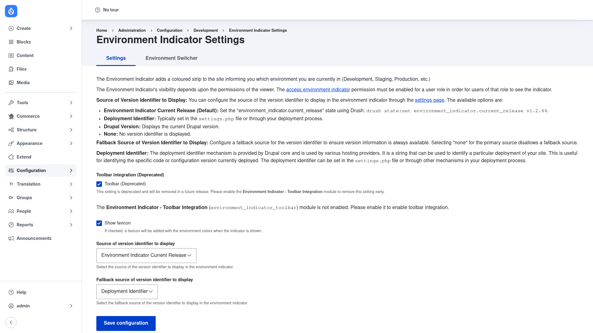

# Installation

## Requirements

Environment Indicator needs **Drupal 9.3, 10, or 11** (its core version
requirement is `^9.3 || ^10 || ^11`). It has no other contrib module
dependencies — it works on a stock Drupal install.

The module ships with two optional submodules you can enable later if you want
them:

- **Environment Indicator - Toolbar Integration** (`environment_indicator_toolbar`)
  — tints the admin toolbar to match the environment.
- **Environment Indicator UI** (`environment_indicator_ui`) — adds a UI for
  managing per-environment toolbar settings.

## Install with Composer

From the project root:

```bash
composer require drupal/environment_indicator -W
```

The `-W` (`--with-all-dependencies`) flag lets Composer update any shared
dependencies as needed.

> **Using DDEV?** Prefix Composer and Drush with `ddev` when you run them from
> your host machine — `ddev composer require drupal/environment_indicator -W`,
> `ddev drush …`. Inside the container (`ddev ssh`) run them without the prefix.

## Enable the module

```bash
drush en environment_indicator -y
```

Once enabled, the settings screen appears under **Configuration → Development →
Environment Indicator** (`/admin/config/development/environment-indicator`).

## Grant the permission that makes the bar visible

The coloured indicator is **not** shown to everyone. Its visibility depends on the
viewer's permissions: the **`access environment indicator`** permission must be
granted to a role before users in that role can see the bar. Until you grant it,
nobody will see the indicator even after it is configured.

Grant it from **People → Permissions**
(`/admin/people/permissions`), or from the command line — for example to let all
logged-in users see the indicator:

```bash
drush role:perm:add authenticated 'access environment indicator'
```

A second, more sensitive permission — **`administer environment indicator
settings`** — controls who can open the settings form and add or edit Environment
Switcher entries. Grant that only to trusted administrators.

## Verify it worked

Log in as an administrator and go to
`/admin/config/development/environment-indicator`. You should see the
**Environment Indicator Settings** page with a **Settings** tab and an
**Environment Switcher** tab:



If the page loads, the module is installed correctly. Next, review the
[configuration](../configuration/index.md) to give each environment its own colour.
