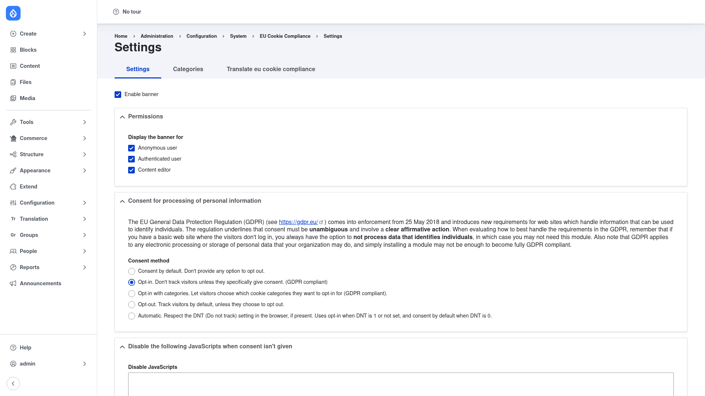

# EU Cookie Compliance — manual setup guide

**EU Cookie Compliance** (`eu_cookie_compliance`) shows visitors a GDPR/ePrivacy
cookie-consent banner and — depending on how you configure it — can block cookies
and JavaScript until the visitor consents. It aims to help your site meet the EU
cookie regulation by asking for consent before non-essential cookies and scripts
run.

The banner sits at the top or bottom of every page with a message you write and
agree/disagree/more-info buttons. It supports several **consent models** — from a
plain informational notice to a full opt-in flow — and can offer **per-category
consent**, where visitors choose which named cookie categories (for example
functional, analytics, marketing) they accept. When you use category-based
consent, the module can hold back analytics and marketing scripts until the
matching category is accepted.

This guide is written for a **human** clicking through the admin UI. It walks you,
step by step and with screenshots, from installing the module to configuring the
consent banner by hand. If you are looking for terse, token-cheap references for an
AI coding agent, read the sibling [`agent/`](../agent/start.md) docs instead.

## Where it lives in the admin menu

Everything in this guide sits under **Configuration → System → EU Cookie
Compliance → Settings**
(`/admin/config/system/eu-cookie-compliance/settings`). That page is organised
into tabs:

- **Settings** — the main configuration form: enable the banner, choose who sees
  it, pick a consent method, and control which scripts are blocked.
- **Categories** — define the named cookie categories used by the "Opt-in with
  categories" consent method.
- **Translate eu cookie compliance** — translate the banner text and settings into
  other languages.

## Contents

1. [Installation](installation/index.md) — install EU Cookie Compliance with
   Composer and enable it.
2. [Configuration](configuration/index.md) — enable the banner, choose who sees
   it, and pick the consent model that fits your legal requirements.
