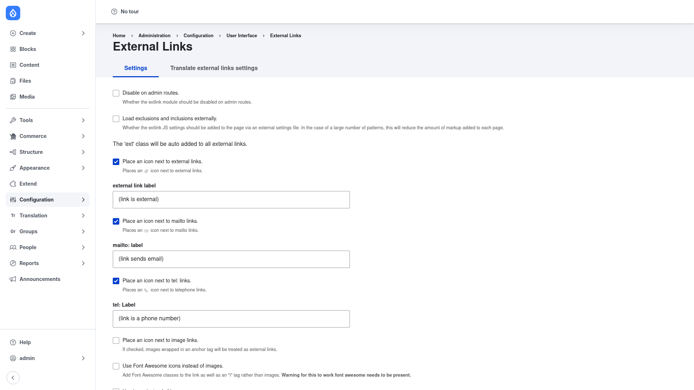

# External Links — manual setup guide

**External Links** (`extlink`) automatically marks the links that lead *off* your
site. When a visitor is about to leave — following a link to another domain, a
`mailto:` email link, or a `tel:` phone link — the module decorates that link so
the reader knows what is coming: it can add a small **icon** after (or before) the
link, optionally **open the link in a new tab**, and optionally show a **"you are
leaving this site" confirmation pop-up** before the browser follows it. It can also
add `rel="nofollow"`/`rel="noreferrer"` attributes and extra CSS classes for
theming.

External Links is a pure client-side (JavaScript) module: it attaches a small
script to your pages that scans the rendered links and decorates the external ones.
Nothing about your content or stored markup changes — the decorations are applied
in the visitor's browser, so they only appear for visitors who have JavaScript
enabled.

This guide is written for a **human** clicking through the admin UI. It walks you,
step by step and with a screenshot, from installing the module to tuning its
settings. If you are looking for terse, token-cheap references for an AI coding
agent, read the sibling [`agent/`](../agent/start.md) docs instead.

## Where it lives in the admin menu

Everything in this guide sits on a single settings form at **Configuration → User
interface → External Links** (`/admin/config/user-interface/extlink`). That page
has two tabs:

- **Settings** — every option described in this guide.
- **Translate external links settings** — translate the icon labels, new-window
  notice, and confirmation text into your site's other languages.

## Contents

1. [Installation](installation/index.md) — install External Links with Composer and
   enable it.
2. [Configuration](configuration/index.md) — walk through the settings form and
   turn on the icon, new-window, confirmation, and include/exclude options.
