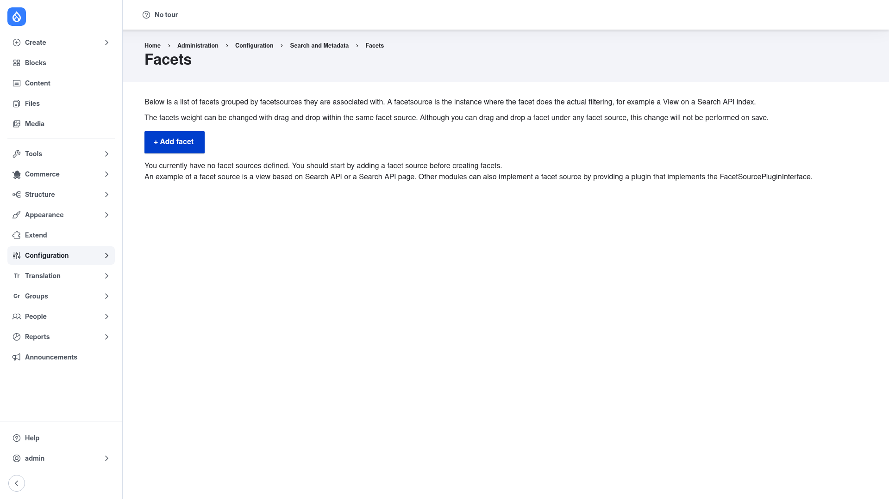

# Configuration — the Facets list and the facet-source prerequisite

Facets has no site-wide settings form to fill in. Configuration happens per facet:
you create facets, and each one carries its own source, field, widget, and
processors. The starting point for all of that is the **Facets** list page.

## Open the Facets list

1. Go to **Configuration → Search and metadata → Facets**
   (`/admin/config/search/facets`).

The page explains that facets are **grouped by the facet source they are
associated with** — a facet source being "the instance where the facet does the
actual filtering, for example a View on a Search API index." You can reorder
facets by weight with drag-and-drop *within the same facet source*.

## The prerequisite: you must have a facet source first

This is the single most important thing to understand about Facets: **a facet
cannot exist without a facet source**, and a facet source is a **Search API index
that has been indexed** — typically surfaced as a **View based on Search API** or a
**Search API page**. On a fresh install with no search set up yet, the list page
tells you exactly this:

> You currently have no facet sources defined. You should start by adding a facet
> source before creating facets.

In other words, before you can create a single facet you must:

1. Install and configure **Search API** — create a **server** and an **index**.
   See the [Search API manual setup guide](../../../../search_api/1.41.x/human-docs/index.md).
2. Add the **fields** you want to turn into filters (category, price, tags, content
   type, and so on) to that index.
3. **Index your content** so those fields hold data.
4. Expose the index through a **View** (a page display running a Search API query)
   or a Search API page. That view/display is what becomes selectable as a facet
   source.

Only once such a source exists will the **+ Add facet** form let you pick it and
choose a field to facet on. If you try to add a facet before then, Facets shows
the "no facet sources defined" message instead of the form — see
[Creating a facet](../creating-a-facet/index.md).

## What you configure per facet

Every facet is a config entity (`facets.facet.*`) that you build on the add and
settings forms. The pieces are:

- **Facet source** — which Search API view/display the facet filters.
- **Field** — the single indexed field the facet is built from.
- **Widget** — how the facet renders: checkboxes, links, or a dropdown.
- **Processors** — optional behaviours such as hiding empty facets, limiting the
  number of items shown, or sorting the values.

The next section walks through creating one end to end.
