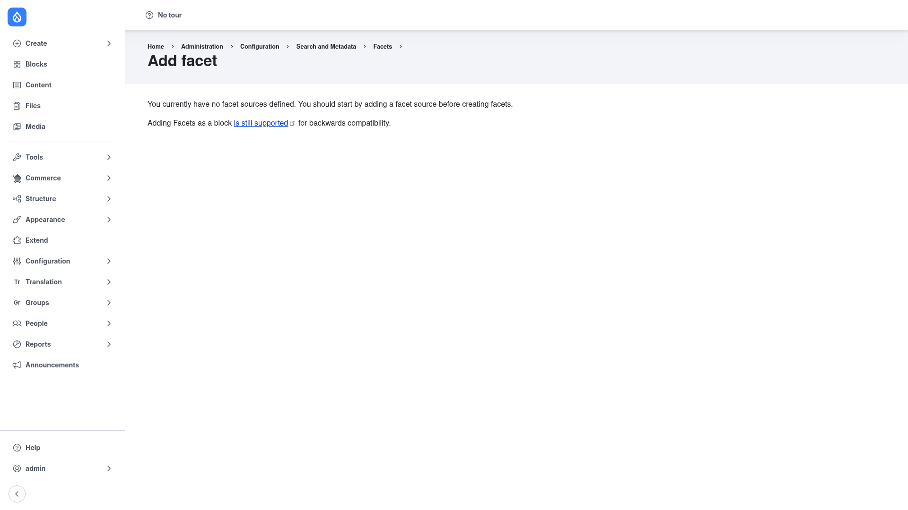

# Creating a facet

This page walks through building one facet from start to finish: making sure a
facet source exists, adding the facet, choosing how it looks and behaves, and
finally placing it on the page next to your search results.

## Step 1 — Make sure a facet source exists

A facet always filters a **facet source**: a Search API view or display that has
been built and indexed. **You cannot create a facet without one.** If none exists,
the **Add facet** page does not show the facet form — it shows the prerequisite
message instead:

> You currently have no facet sources defined. You should start by adding a facet
> source before creating facets.

(The page also notes that adding Facets as a block is still supported for backwards
compatibility.)

If you see this message, stop and set up the source first:

1. Install and configure **Search API** — create a **server** and an **index**.
   Follow the [Search API manual setup guide](../../../../search_api/1.41.x/human-docs/index.md).
2. Add the **fields** you want to filter on (category, tags, content type, price,
   and so on) to the index.
3. **Index your content** so those fields contain data.
4. Build a **View** (a page display running a Search API query) or a Search API
   page that displays the index. This view/display is what Facets offers as a
   facet source.

Once at least one facet source is available, return to
`/admin/config/search/facets` and continue.

## Step 2 — Start the Add facet form

1. Go to **Configuration → Search and metadata → Facets**
   (`/admin/config/search/facets`).
2. Click **+ Add facet**.

With a facet source present, this form now asks you to define the new facet.

## Step 3 — Choose the facet source and field

1. **Facet source** — select the Search API view/display you want to filter. This
   ties the facet to a specific set of search results.
2. **Field** — choose the single **indexed field** the facet is built from (for
   example *Category*, *Tags*, *Content type*, or *Price*). Only fields present on
   that source's index are offered, which is why the field has to be indexed
   first.
3. Give the facet a clear **name** — this is the label visitors see above the
   filter (for example "Category").

Save to create the facet and move on to its settings.

## Step 4 — Choose a widget

The **widget** decides how the facet renders. On the facet's settings form you can
pick from the built-in widgets:

- **Checkboxes** — a list of values each with a checkbox; good for letting
  visitors select several values at once.
- **List of links** — each value is a clickable link; selecting one filters the
  results and the link toggles off to clear it.
- **Dropdown** — a single select box; compact, good for long lists or tight
  sidebars.

Many widgets can also show a **result count** next to each value (for example
"News (42)") so visitors see how many items match before clicking.

## Step 5 — Enable processors

**Processors** shape how the facet behaves. They are optional, but a few are worth
enabling on almost every facet. On the settings form, tick the ones you want:

- **Hide facets with no results (hide empty / non-narrowing)** — removes values
  that would return nothing or would not actually refine the current results, so
  the filter never offers a dead end.
- **Sort** — order the facet items by **count** (most results first), by **display
  value** (alphabetical), or by active state. Pick whichever reads best for the
  field.
- **Soft limit / count limit** — cap how many values are shown; the soft limit
  adds a **Show more / Show less** toggle so a long list stays tidy.

You can enable several processors and order them; each runs at the appropriate
stage (before the query, after the query, or while building the display).

## Step 6 — Save

Click **Save** to store the facet. It now appears on the
[Facets list page](../configuration/index.md), grouped under its facet source.

## Step 7 — Place the facet block (or add it to the view)

A saved facet does not appear to visitors until you put it on the page next to the
search results it filters. The usual way is as a **block**:

1. Go to **Structure → Block layout** (`/admin/structure/block`).
2. In the region where you want the filter (commonly a sidebar next to your search
   results), click **Place block**.
3. Find your facet in the list — each facet provides its own block — and place it.
4. On the block configuration form, it is good practice to restrict visibility to
   the search results page so the filter only shows where it makes sense. Save the
   block.

Alternatively, with the *Facets Exposed Filters* submodule you can render the
facet as an **exposed filter inside the view** itself instead of as a separate
block.

## Result

Visit your search results page. The facet now appears as a filter; selecting a
value narrows the results, the count updates, and the chosen values are kept in the
page URL so the filtered view can be bookmarked and shared. Repeat these steps for
each field you want to expose as a filter.
