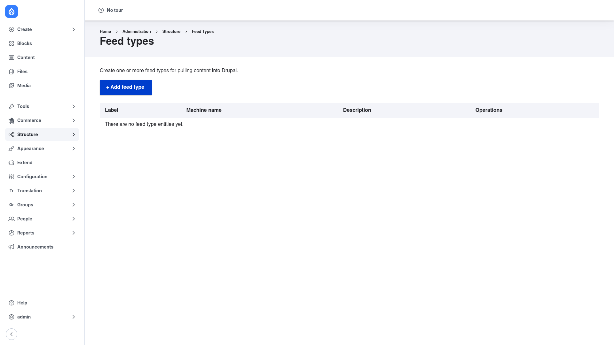

# Configuration — feed types and the import pipeline

Feeds has very little global configuration. The real work happens in **feed
types**, and every feed type is built from the same three-stage pipeline. Before
you create one, it helps to understand that pipeline.

## The Feed types list

Go to **Structure → Feed types** (`/admin/structure/feeds`). This page lists
every feed type on the site and provides the **+ Add feed type** button. On a
fresh install the list is empty — "There are no feed type entities yet."



Each row shows the feed type's **Label**, its **Machine name**, an optional
**Description**, and an **Operations** menu where you edit the feed type, open its
field **Mapping**, or delete it. Feed types are exportable configuration, so you
can build one on a development site and deploy it to production.

## The fetcher → parser → processor pipeline

Every import runs through three plugins, chosen when you create the feed type:

- **Fetcher — *where the data comes from.*** Feeds ships three:
  - **Download from url** — fetch the data over HTTP from a URL you enter on each
    feed.
  - **Upload** — upload a file (for example a CSV) through the feed form.
  - **Directory** — read files that have been dropped into a directory on the
    server.

- **Parser — *how the raw data is read.*** Built-in parsers include:
  - **RSS/Atom** (syndication) — for news and blog feeds.
  - **CSV** — for spreadsheet-style comma-separated files.
  - **OPML** — for blogroll / subscription lists.
  - **Sitemap** — for XML sitemaps.

  The companion **Feeds Extensible Parsers** module adds JSON and XPath/JMESPath
  XML parsers (see [Installation](../installation/index.md)).

- **Processor — *what gets created or updated.*** The processor decides which
  entity type and bundle each parsed item becomes — for example the **Node**
  processor creating **Article** nodes, or a generic entity processor creating
  users or taxonomy terms.

Once those three are chosen you connect the source data to fields on the
**Mapping** screen, and optionally set an import schedule. The next section walks
through all of this.

## Global setting

The only site-wide setting is a lock timeout — how long a single import may hold
its lock before it is considered stale. It defaults to 12 hours (`43200`
seconds) and rarely needs changing. It lives in the `feeds.settings` config and
can be read or set with Drush:

```bash
drush config:get feeds.settings
drush config:set feeds.settings lock_timeout 3600
```

Continue to [Creating a feed type](../creating-a-feed-type/index.md).
