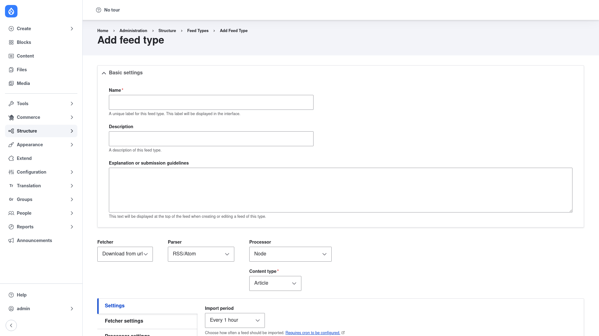

# Creating a feed type and running your first import

A **feed type** is the reusable template that defines how a particular kind of
data is imported: its fetcher, parser, processor, and field mappings. Once the
feed type exists you create a **feed** — a concrete source of that type — and
import it. This page walks through the whole flow.

## 1. Open the Add feed type form

1. Go to **Structure → Feed types** (`/admin/structure/feeds`).
2. Click **+ Add feed type** (`/admin/structure/feeds/add`).

## 2. Name the feed type and choose the pipeline

On the Add feed type form:

1. **Name** — a unique label for the feed type (for example *Product CSV* or
   *Partner news feed*). This label appears in the interface and a machine name
   is generated from it. You can also add an optional **Description** and
   **Explanation or submission guidelines** (help text shown at the top of the
   feed form).

2. **Fetcher** — choose *where the data comes from*:
   - **Download from url** to fetch over HTTP,
   - **Upload** to upload a file through the feed form, or
   - **Directory** to read files placed in a server directory.

3. **Parser** — choose *how the data is read*: **RSS/Atom** for syndication
   feeds, **CSV** for spreadsheet files, **OPML**, or **Sitemap**. (JSON and
   XPath/JMESPath XML become available if you install Feeds Extensible Parsers.)

4. **Processor** — choose *what gets created or updated*. For example the **Node**
   processor, which then reveals a **Content type** selector where you pick the
   bundle (such as **Article**) that each imported item becomes.

Below these selectors are collapsible **Settings**, **Fetcher settings**, and
**Processor settings** sections. The most useful setting here is **Import
period** — how often a feed of this type is re-imported by cron (for example
*Every 1 hour*, or *Off* for manual-only imports; scheduled imports require cron
to be configured).

Click **Save and add mappings** (or **Save**) to store the feed type.

## 3. Map source data onto fields

Saving takes you to the **Mapping** screen (also reachable from the feed type's
**Operations → Mapping**). This is where you connect each piece of the incoming
data to a field on the entity being created.

1. Each row maps a **source** (an RSS element, a CSV column, an XML value) to a
   **target** — a field on the entity, such as the node **Title**, **Body**,
   an image field, or an entity reference.
2. Add a mapping, pick the target field, then define or select the source element
   it should read from.
3. Mark at least one target as **unique** (a GUID or unique key — for RSS this is
   typically the item GUID or URL; for CSV, a column that uniquely identifies each
   row). When a target is unique, re-importing **updates** the existing entity
   instead of creating a duplicate. Without a unique target, every import creates
   new content.

Save the mappings when you are done.

## 4. Create a feed and import it

The feed type is only a template — now create an actual feed of that type and
run it:

1. Go to **Content → Feeds** (`/admin/content/feed`) and add a new feed of your
   feed type (or use the add-feed link for that type).
2. Give the feed a title and provide its source: the **URL** to fetch (for the
   Download fetcher) or the **file to upload** (for the Upload fetcher).
3. Save the feed, then click **Import**. Feeds fetches the source, parses it, and
   creates or updates entities according to your mappings. A batch progress bar
   runs for larger imports.
4. Check the result under **Content** (`/admin/content`) — the imported nodes (or
   other entities) should now be listed.

From here, if you set an **Import period**, cron will re-import the feed
automatically on that schedule; otherwise re-run it manually with the **Import**
button whenever the source changes.
