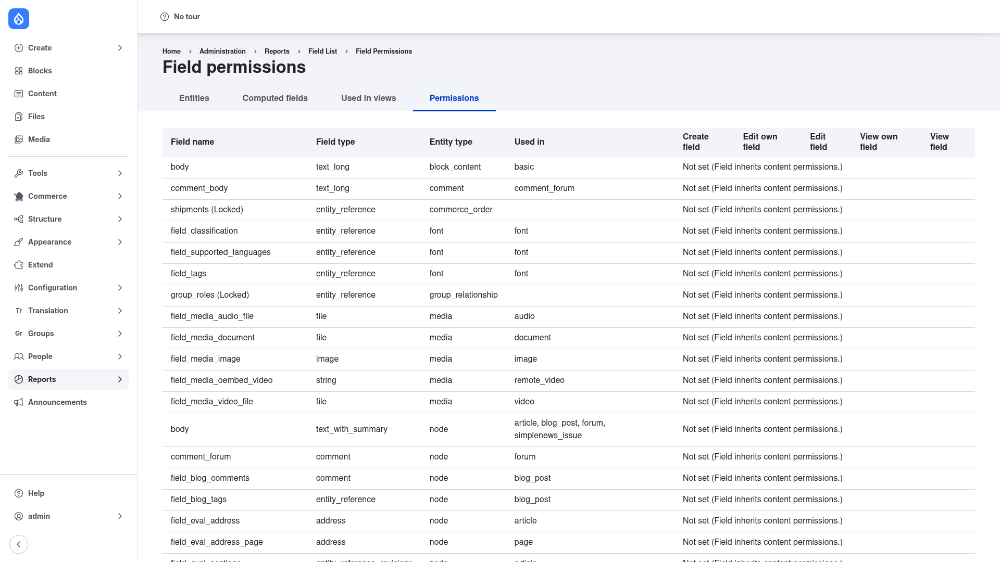

# Field Permissions — manual setup guide

**Field Permissions** (`field_permissions`) adds **per-field access control** to
Drupal. Out of the box, Drupal decides who can see or change a field at the
*entity* level — if you can edit a node, you can edit every field on it. Field
Permissions overrides that on a **field-by-field basis**, letting you decide who
may create, edit, and view the value of any individual field.

For each field you pick one of three modes:

- **Public** — the default. The field behaves like a normal Drupal field and
  inherits the entity's access rules.
- **Private** — only the entity's author and users with the *"access private
  fields"* permission can see or edit the value. Everyone else never sees it.
- **Custom permissions** — you get a per-role grid where you grant the granular
  permissions *create*, *edit own / edit any*, and *view own / view any* for that
  specific field, per role.

A site-wide **report** page then gives you an overview of every field and how its
access is configured, so you can audit field-level security at a glance.

This guide is written for a **human** clicking through the admin UI. It walks you,
step by step and with screenshots, from installing the module to setting a field's
permissions and reviewing them on the report page. If you are looking for terse,
token-cheap references for an AI coding agent, read the sibling
[`agent/`](../agent/start.md) docs instead.

## Where it lives in the admin menu

Field permissions are set in two places:

- **Per field** — on each field's own settings form, under **Structure → Content
  types → *(your type)* → Manage fields → *(the field)* → edit**. A
  *"Field visibility and permissions"* section is added there.
- **The report** — a read-only overview at **Reports → Field list → Permissions**
  (`/admin/reports/fields/permissions`), which lists every field on the site with
  its permission type and the per-role grants.

Two site-wide permissions gate all of this, granted on **People → Permissions**:
*"Administer field permissions"* (lets a role choose a field's permission type and
custom grid) and *"Access private fields"* (lets a role view and edit every field
marked **Private**, on any user's content).

## Contents

1. [Installation](installation/index.md) — install Field Permissions with Composer
   and enable it.
2. [Configuration](configuration/index.md) — set a field's permission type
   (Public / Private / Custom), grant the custom per-role permissions, and review
   everything on the report page.
