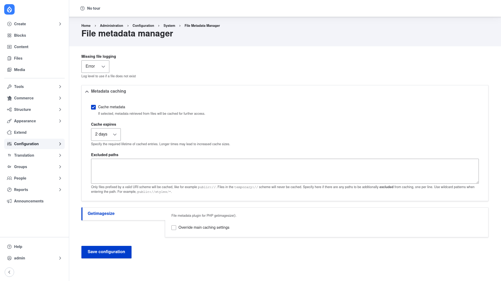

# File Metadata Manager — manual setup guide

**File Metadata Manager** (`file_mdm`) is a support and API module. It provides
a central service that reads, caches, and (where supported) writes **file
metadata** — image dimensions from PHP's `getimagesize()`, and, through its
submodules, EXIF/IPTC data and font information. The point is that several
modules on your site often need the same facts about the same file. Instead of
each one re-opening and re-parsing that file, File Metadata Manager reads it
once and keeps the result in a dedicated cache, so repeated lookups — across a
request or across page loads — are cheap. This is a real saving for
stream-wrapped or remote files, which otherwise have to be copied to a local
temporary path every time they are parsed.

Be honest about what this module is: **it is mostly a dependency.** You rarely
install File Metadata Manager because you want it directly. You install it
because another module needs it — most commonly the **ImageAPI Optimize** and
**Image Effects** modules, which lean on it for efficient access to image
dimensions and EXIF orientation. There is no content to create and no
day-to-day workflow here. Site builders touch it in exactly one place: a small
settings page that controls how long metadata is cached and which paths are
excluded.

This guide is written for a **human** clicking through the admin UI. If you are
looking for terse, token-cheap references for an AI coding agent — the service
API, the plugin type, config schema — read the sibling
[`agent/`](../agent/start.md) docs instead.

## Where it lives in the admin menu

There is a single configuration page, at **Configuration → System → File
metadata manager** (`/admin/config/system/file_mdm`). It holds the metadata
caching options plus a section for each installed metadata plugin (for example
**Getimagesize**, and — if you enable the submodules — EXIF and font plugins).

## Contents

1. [Installation](installation/index.md) — install File Metadata Manager with
   Composer, enable it, and optionally enable the EXIF submodule.
2. [Configuration](configuration/index.md) — walk the settings page: metadata
   caching, cache lifetime, excluded paths, missing-file logging, and the
   per-plugin cache overrides.
