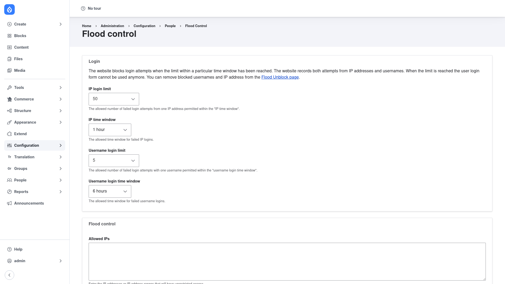

# Flood Control — manual setup guide

**Flood Control** (`flood_control`) exposes Drupal core's hidden flood-protection
limits in the admin UI. Core throttles repeated failed logins and similar events
using thresholds stored in the `user.flood` configuration object — but core ships
**no interface** for them, so tuning those limits normally means editing
configuration by hand. This module adds a settings form where you can raise or
lower those thresholds, and a companion "Flood unblock" screen where you can clear
flood entries for a user or IP that has been locked out.

In short, Flood Control lets a site builder or support staffer:

- **Adjust the thresholds** that decide how many failed login attempts an IP
  address or a username is allowed before it is blocked, and for how long.
- **Unblock a locked-out user or IP** immediately by clearing its flood entries,
  instead of waiting for the time window to expire.

This guide is written for a **human** clicking through the admin UI. It walks you,
step by step and with screenshots, from installing the module to tuning the flood
limits and clearing a lockout. If you are looking for terse, token-cheap
references for an AI coding agent, read the sibling [`agent/`](../agent/start.md)
docs instead.

## Where it lives in the admin menu

The settings form sits under **Configuration → People → Flood control**
(`/admin/config/people/flood-control`). A separate **Flood unblock** screen — where
you view and clear currently blocked IPs and user IDs — lives at
`/admin/people/flood-unblock` and is linked directly from the settings form.

## Contents

1. [Installation](installation/index.md) — install Flood Control with Composer and
   enable it.
2. [Configuration](configuration/index.md) — adjust the failed-login thresholds and
   time windows, then clear flood entries to unblock a locked-out user or IP.
