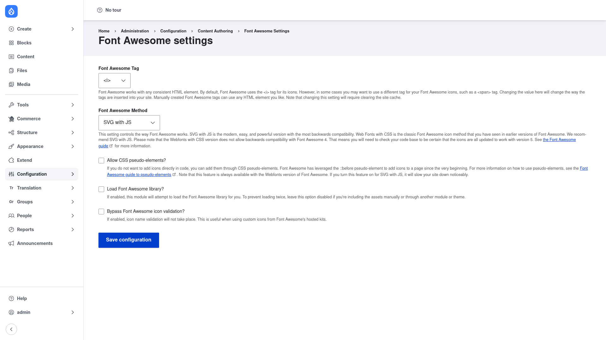

# Font Awesome — manual setup guide

**Font Awesome** (`fontawesome`) integrates the popular
[Font Awesome](https://fontawesome.com/) icon library — the most widely used
icon set and toolkit on the web — into your Drupal site. Once it is installed,
editors and site builders can add scalable vector icons in two main ways:

- A dedicated **icon field** (`fontawesome_icon`) that you attach to any
  fieldable entity — a content type, taxonomy term, or user — with an
  autocomplete widget for picking an icon by name and a formatter that renders
  it as SVG or webfont markup.
- A **CKEditor 5 button and icon dialog** so editors can drop icons straight
  into rich-text fields while they write.

A single global settings form controls how the icon library itself is delivered
to the browser — from the Font Awesome **CDN** or from a **locally installed**
copy, and using the modern **SVG-with-JS** method or the classic **webfont**
method.

This guide is written for a **human** clicking through the admin UI. It walks
you step by step, with screenshots, from installing the module to choosing how
the library loads. If you are looking for terse, token-cheap references for an
AI coding agent, read the sibling [`agent/`](../agent/start.md) docs instead.

## Where it lives in the admin menu

The module's global settings live at **Configuration → Content authoring → Font
Awesome settings** (`/admin/config/content/fontawesome`). That one page is where
you choose the load method and the delivery options covered in this guide.

The icon **field** is added per entity in the usual place — **Structure →
Content types → *(your type)* → Manage fields** — and the CKEditor integration
is configured through your text formats under **Configuration → Content
authoring → Text formats and editors**.

## Contents

1. [Installation](installation/index.md) — install Font Awesome with Composer,
   enable it, and provide the icon library (CDN or a local download).
2. [Configuration](configuration/index.md) — walk through the settings page to
   choose the load method and options, then add the icon field and wire up
   CKEditor.
